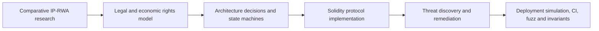
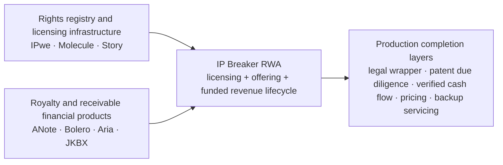
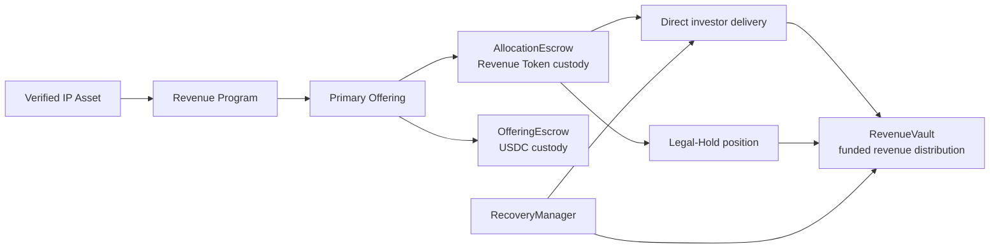
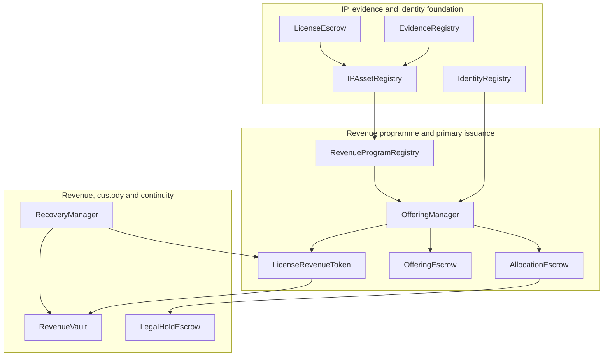
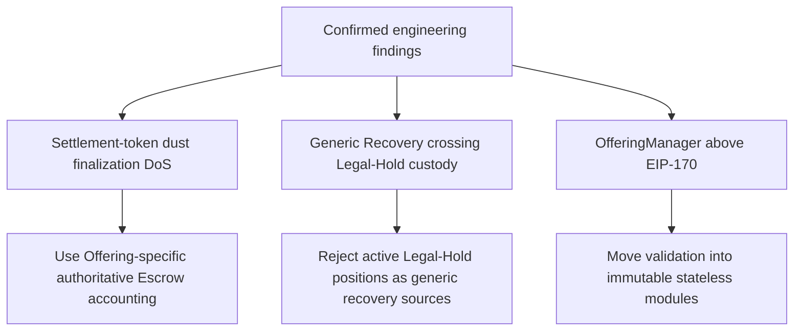

<div align="center">

# IP Breaker RWA

### Compliance-aware IP licensing and revenue-participation infrastructure

Transforming verified intellectual-property assets into programmable, transparent, and compliance-aware revenue participation instruments.

[](https://zenodo.org/records/21335130?preview_file=patent_rwa_arxiv_v02.pdf)
[](https://soliditylang.org/)
[](test/)
[](script/DeployFullProtocol.s.sol)
[](docs/Phase3.3-Security-Hardening-Plan.md)
[](#scope-and-trust-boundaries)

[**Read the paper**](https://zenodo.org/records/21335130?preview_file=patent_rwa_arxiv_v02.pdf)
· [**Explore the architecture**](docs/Documentation-Index.md)
· [**Review the security journey**](docs/Phase3.3-Security-Hardening-Plan.md)
· [**Run the full deployment**](script/DeployFullProtocol.s.sol)

</div>

> [!IMPORTANT]
> IP Breaker RWA is a research prototype with a complete Solidity protocol core, full deployment simulation, and automated security regression. It is not an audited production financial product or a substitute for legal, regulatory, valuation, patent-validity, or investment review.

---

## At a glance

<table>
<tr>
<td width="25%" align="center"><strong>Research-backed</strong><br/><sub>Public Zenodo paper and comparative IP-RWA analysis</sub></td>
<td width="25%" align="center"><strong>Lifecycle-complete core</strong><br/><sub>Asset → Offering → Revenue → Recovery</sub></td>
<td width="25%" align="center"><strong>Security-driven</strong><br/><sub>Real findings, regression tests, fuzz and invariants</sub></td>
<td width="25%" align="center"><strong>Executable</strong><br/><sub>Full protocol deployment simulation and CI</sub></td>
</tr>
<tr>
<td align="center"><strong>DOI</strong><br/><code>10.5281/zenodo.21335130</code></td>
<td align="center"><strong>Dual Escrow</strong><br/>Token custody + USDC custody</td>
<td align="center"><strong>406</strong><br/>Foundry tests passed</td>
<td align="center"><strong>21,958 bytes</strong><br/>OfferingManager runtime</td>
</tr>
</table>

### One-sentence thesis

> **Patent-RWA is not an NFT problem; it is a structured-product design problem under intellectual-property uncertainty.**

IP Breaker RWA therefore focuses not only on Token issuance, but on the legal, economic, custody, accounting, compliance, recovery, and failure-state boundaries required by an IP-linked revenue lifecycle.

---

# Why this project stands out

<table>
<tr>
<td width="33%"><strong>🧾 Rights separation</strong><br/>An IP Asset NFT is an asset passport and evidence container, not automatic legal ownership, a licence, or a Revenue Token.</td>
<td width="33%"><strong>🏦 Dual Escrow</strong><br/><code>AllocationEscrow</code> holds Revenue Tokens while <code>OfferingEscrow</code> separately holds investor USDC.</td>
<td width="33%"><strong>💧 Funded-revenue boundary</strong><br/>Only settlement assets actually deposited and accounted for in <code>RevenueVault</code> become Token-holder claims.</td>
</tr>
<tr>
<td><strong>⚖️ Legal-Hold without confiscation</strong><br/>Each remediation subscription receives an isolated deterministic position that preserves the original beneficial owner and accrued revenue.</td>
<td><strong>🔐 Recovery-aware accounting</strong><br/>Wallet recovery migrates the complete Token balance and historical Vault state atomically, with EIP-712 consent and separated roles.</td>
<td><strong>🧩 Deployable protocol engineering</strong><br/>Immutable stateless modules reduced <code>OfferingManager</code> from roughly 30 KB to 21,958 bytes without proxy or <code>delegatecall</code>.</td>
</tr>
</table>

---

# From research to executable evidence



The repository is designed as a traceable evidence chain rather than a code-only demo:

- **Research:** existing IP registries, IP-NFTs, programmable-IP protocols, royalty products, regulated tokenised products, and failed or contracted platforms.
- **Design:** rights separation, funded-revenue accounting, custody isolation, eligibility, Legal-Hold, recovery, and atomic finalization.
- **Implementation:** Solidity contracts with deterministic IDs, state-machine gates, exact accounting, and fixed dependency bindings.
- **Verification:** 406 passing tests, targeted regressions, fuzzing, invariant suites, code-size checks, Mermaid rendering checks, and a complete deployment simulation.

### Research resources

- **[Research paper](https://zenodo.org/records/21335130?preview_file=patent_rwa_arxiv_v02.pdf)**
- **[Existing IP-RWA Landscape and Product Roadmap](docs/Existing-IP-RWA-Landscape-and-Product-Roadmap.md)**
- **[Research-to-Protocol Mapping](docs/Research-to-Protocol-Mapping.md)**
- **[Full Documentation Index](docs/Documentation-Index.md)**

---

# Where IP Breaker RWA sits

The research identifies two broad market routes. IP Breaker RWA currently sits between them:



> **Current positioning:** Compliance-aware IP licensing and revenue-participation infrastructure.

The protocol architecture is comparatively complete, but the project does not claim that legal wrappers, patent-specific due diligence, real-world revenue completeness, jurisdiction-specific investor protection, pricing, liquidity, or backup servicing are already solved.

---

# End-to-end protocol lifecycle



```text
Verified IP Asset
        ↓
Revenue Program
        ↓
Revenue Token + Primary Offering
        ↓
Investor Allocation or Legal-Hold Custody
        ↓
Funded Revenue Distribution
        ↓
Wallet Recovery and Compliance Continuity
```

---

# Core architecture



<details>
<summary><strong>Component responsibilities</strong></summary>

### `OfferingManager`

Owns canonical Offering and Subscription state, deterministic IDs, sequencing, reconciliation, delivery orchestration, and finalization. It does not intentionally custody Revenue Tokens or offering USDC.

### `AllocationEscrow`

Holds the complete initial Revenue Token supply, freezes immutable allocations, performs direct delivery, and moves remediation allocations into isolated Legal-Hold positions.

### `OfferingEscrow`

Holds investor USDC, enables full refunds after a failed offering, and freezes independent pull-payment entitlements for the issuer and protocol fee after success.

### `RevenueVault`

Accounts only for settlement assets actually deposited as operating revenue. It uses cumulative revenue-per-share accounting, pending rewards, reward debt, precision remainder, and solvency checks.

### `LegalHoldEscrow`

Creates one deterministic custody position per remediation subscription while preserving the original beneficial owner, amount, sequence, and historical revenue relationship.

### `RecoveryManager`

Uses EIP-712 destination consent, nonces, independent verification and approval roles, a challenge period, and a bounded execution window to restore access to an existing economic position.

</details>

---

# Security hardening journey



| Finding | Why it mattered | Resolution |
| --- | --- | --- |
| Settlement-token dust finalization DoS | Any ERC-20 holder could transfer one base unit to `OfferingManager` and block an incorrect zero-balance gate | Finalization now relies on Offering-specific authoritative Escrow accounting, not ambient wallet balances |
| Generic Recovery crossing Legal-Hold custody | A broad recovery path could bypass the original-beneficiary-bound Legal-Hold release process | `LicenseRevenueToken` rejects active Legal-Hold positions as generic recovery sources |
| `OfferingManager` exceeded EIP-170 | All tests passed, but the approximately 30 KB runtime could not be deployed on a standard EVM network | Validation and finalization checks moved into immutable stateless modules while canonical storage and asset movement remain in the Manager |

```text
OfferingManager runtime: 21,958 bytes
EIP-170 limit:           24,576 bytes
Remaining margin:         2,618 bytes
```

Detailed threat model: **[Phase 3.3 Security Hardening Plan](docs/Phase3.3-Security-Hardening-Plan.md)**

---

# Executable evidence

<table>
<tr>
<td align="center"><strong>406 / 406</strong><br/><sub>Foundry tests</sub></td>
<td align="center"><strong>80 / 80</strong><br/><sub>OfferingManager targeted tests</sub></td>
<td align="center"><strong>18 / 18</strong><br/><sub>RevenueVault tests</sub></td>
<td align="center"><strong>256 runs</strong><br/><sub>Legal-Hold fuzz</sub></td>
</tr>
<tr>
<td align="center"><strong>PASS</strong><br/><sub>Full deployment simulation</sub></td>
<td align="center"><strong>PASS</strong><br/><sub>Security regressions</sub></td>
<td align="center"><strong>PASS</strong><br/><sub>State-machine suites</sub></td>
<td align="center"><strong>PASS</strong><br/><sub>Invariant suites</sub></td>
</tr>
</table>

The full deployment script creates the complete testnet protocol bundle, precomputes the deterministic `offeringId`, deploys the Offering-specific Token, Vault and Escrows, creates a Draft Offering, and verifies bindings and non-custodial invariants.

```bash
forge script script/DeployFullProtocol.s.sol:DeployFullProtocol -vvv
```

<details>
<summary><strong>Sepolia broadcast command and deployment notes</strong></summary>

```bash
forge script script/DeployFullProtocol.s.sol:DeployFullProtocol \
  --rpc-url "$SEPOLIA_RPC_URL" \
  --broadcast \
  -vvvv
```

The testnet deployment uses demo eligibility modules and a mock six-decimal USDC. They are not production KYC, sanctions, transfer-agent, or settlement infrastructure.

</details>

---

# Key design invariants

<details open>
<summary><strong>Rights, supply, funds and revenue preservation</strong></summary>

### Rights separation

```text
IP Asset NFT
    ≠ legal ownership transfer by itself
    ≠ licence right
    ≠ Revenue Token
    ≠ governance right
```

### Supply conservation

```text
Final Supply
    = Directly Delivered
    + Legal-Hold Custody
```

At finalization, `AllocationEscrow` must hold zero Revenue Tokens.

### Offering-fund conservation

```text
Total Contributions
    = Issuer Proceeds
    + Protocol Fee
```

### Funded-revenue boundary

```text
Expected licence revenue
    ≠ Token-holder claim

Settlement asset deposited into RevenueVault
    + accounted by the Vault
    = funded claimable revenue
```

### Historical-revenue preservation

Every Token mint, transfer, recovery, or Legal-Hold release checkpoints Vault accounting before balances change. A new holder cannot claim revenue accrued by the previous holder.

### Atomic finalization

```text
All subscriptions receive terminal delivery dispositions
        ↓
Revenue Token activates
        ↓
Revenue Program activates
        ↓
RevenueVault deposits become enabled
        ↓
OfferingEscrow freezes proceeds entitlements
        ↓
postconditions pass
        ↓
Offering is written Finalized last
```

Any failed dependency or postcondition reverts the complete transaction.

</details>

---

# Five-minute review paths

<table>
<tr>
<th>Audience</th>
<th>Start here</th>
<th>Then inspect</th>
</tr>
<tr>
<td><strong>Hackathon judge</strong></td>
<td><a href="https://zenodo.org/records/21335130?preview_file=patent_rwa_arxiv_v02.pdf">Research paper</a><br/><a href="docs/Existing-IP-RWA-Landscape-and-Product-Roadmap.md">Market landscape</a></td>
<td><a href="docs/Phase3.2-Atomic-Finalization-Design.md">Atomic Finalization</a><br/><a href="script/DeployFullProtocol.s.sol">Full deployment script</a></td>
</tr>
<tr>
<td><strong>Solidity interviewer</strong></td>
<td><a href="contracts/OfferingManager.sol">OfferingManager</a><br/><a href="contracts/RevenueVault.sol">RevenueVault</a></td>
<td><a href="docs/Phase3.3-Security-Hardening-Plan.md">Security hardening</a><br/><a href="test/OfferingManager.t.sol">Regression tests</a></td>
</tr>
<tr>
<td><strong>Security reviewer</strong></td>
<td><a href="docs/Phase3.3-Security-Hardening-Plan.md">Threat model</a><br/><a href="contracts/LegalHoldEscrow.sol">Legal-Hold custody</a></td>
<td><a href="test/LegalHoldEscrow.t.sol">Isolation fuzz</a><br/><a href="test/LicenseEscrow.Invariant.t.sol">Invariant suite</a></td>
</tr>
<tr>
<td><strong>Investor or RWA reviewer</strong></td>
<td><a href="docs/Existing-IP-RWA-Landscape-and-Product-Roadmap.md">Product roadmap</a><br/><a href="docs/Phase3-Revenue-Model-Design.md">Revenue rights model</a></td>
<td><a href="docs/Research-to-Protocol-Mapping.md">Research-to-protocol mapping</a><br/><a href="#scope-and-trust-boundaries">Trust boundaries</a></td>
</tr>
<tr>
<td><strong>IP or legal reviewer</strong></td>
<td><a href="docs/Phase2.3-Architecture-Freeze.md">Architecture freeze</a><br/><a href="docs/Phase2.3-Permission-Matrix.md">Permission matrix</a></td>
<td><a href="contracts/IPAssetRegistry.sol">IP Asset Passport</a><br/><a href="contracts/LicenseEscrow.sol">Licence agreement lifecycle</a></td>
</tr>
</table>

---

# Featured design records

1. **[Research paper](https://zenodo.org/records/21335130?preview_file=patent_rwa_arxiv_v02.pdf)** — comparative IP-RWA research and product lessons.
2. **[Existing IP-RWA Landscape and Product Roadmap](docs/Existing-IP-RWA-Landscape-and-Product-Roadmap.md)** — market routes, project positioning, failure lessons, and staged product plan.
3. **[Research-to-Protocol Mapping](docs/Research-to-Protocol-Mapping.md)** — how research conclusions became protocol mechanisms.
4. **[Phase 2.3 Architecture Freeze](docs/Phase2.3-Architecture-Freeze.md)** — IP, identity, evidence, and licensing boundary before tokenization.
5. **[Phase 3 Revenue Model Design](docs/Phase3-Revenue-Model-Design.md)** — what the Token represents and explicitly does not represent.
6. **[Phase 3.2 Atomic Finalization Design](docs/Phase3.2-Atomic-Finalization-Design.md)** — cross-contract activation, custody completion, and cash-flow isolation.
7. **[Phase 3.3 Security Hardening Plan](docs/Phase3.3-Security-Hardening-Plan.md)** — confirmed findings, threat models, and acceptance tests.
8. **[`DeployFullProtocol.s.sol`](script/DeployFullProtocol.s.sol)** — executable proof that the complete protocol bundle can be deployed and verified.

All records: **[Documentation Index](docs/Documentation-Index.md)**

---

# Scope and trust boundaries

The current protocol can enforce configured on-chain identities, allocations, custody paths, funded-revenue accounting, and lifecycle transitions. It does not independently prove or guarantee:

- legal ownership, validity, maintenance, territorial scope, or freedom to operate of the underlying IP;
- completeness of off-chain licensing revenue;
- valuation, liquidity, commercial success, principal protection, or yield;
- compliance with securities, tax, sanctions, custody, or offering law in any jurisdiction;
- continuity of an issuer, SPV, revenue attestor, servicer, or external service provider;
- production security or legal readiness without independent review.

These limitations are documented because RWA credibility depends on making the remaining trust assumptions explicit.

---

<details>
<summary><strong>Project structure</strong></summary>

```text
ip-breaker-rwa/
├── contracts/
│   ├── IdentityRegistry.sol
│   ├── IPAssetRegistry.sol
│   ├── EvidenceRegistry.sol
│   ├── LicenseEscrow.sol
│   ├── RevenueProgramRegistry.sol
│   ├── LicenseRevenueToken.sol
│   ├── RevenueVault.sol
│   ├── OfferingManager.sol
│   ├── AllocationEscrow.sol
│   ├── LegalHoldEscrow.sol
│   ├── OfferingEscrow.sol
│   ├── RecoveryManager.sol
│   └── modules/
│       ├── OfferingValidationModule.sol
│       └── OfferingFinalizationModule.sol
├── docs/
│   ├── Documentation-Index.md
│   ├── Existing-IP-RWA-Landscape-and-Product-Roadmap.md
│   ├── Research-to-Protocol-Mapping.md
│   ├── Phase2.3-Architecture-Freeze.md
│   ├── Phase3-Revenue-Model-Design.md
│   ├── Phase3.2-Atomic-Finalization-Design.md
│   └── Phase3.3-Security-Hardening-Plan.md
├── script/
│   ├── Deploy.s.sol
│   ├── Demo.s.sol
│   └── DeployFullProtocol.s.sol
├── test/
└── frontend/
```

</details>

<details>
<summary><strong>Technology stack</strong></summary>

- Solidity 0.8.24
- Foundry
- OpenZeppelin Contracts
- ERC-20 and ERC-721 standards
- EIP-712 and signature verification
- role-based access control
- restricted transfer policies
- Escrow-based settlement
- cumulative revenue-per-share accounting
- state-machine, fuzz, invariant, dependency-failure, code-size, and documentation-render testing

</details>

---

# Why IP Breaker RWA?

Most tokenization projects answer:

> How do we create a Token?

IP Breaker RWA asks a broader question:

> **How do we preserve legal and economic meaning across IP verification, licensing, primary issuance, custody, funded revenue, compliance failure, wallet recovery, and protocol finalization?**

The repository provides a traceable chain from public research, to architecture decisions, to Solidity implementation, to security findings, to executable verification.

---

# License

Open-source project for Web3 research, protocol engineering, and Hackathon demonstration.
