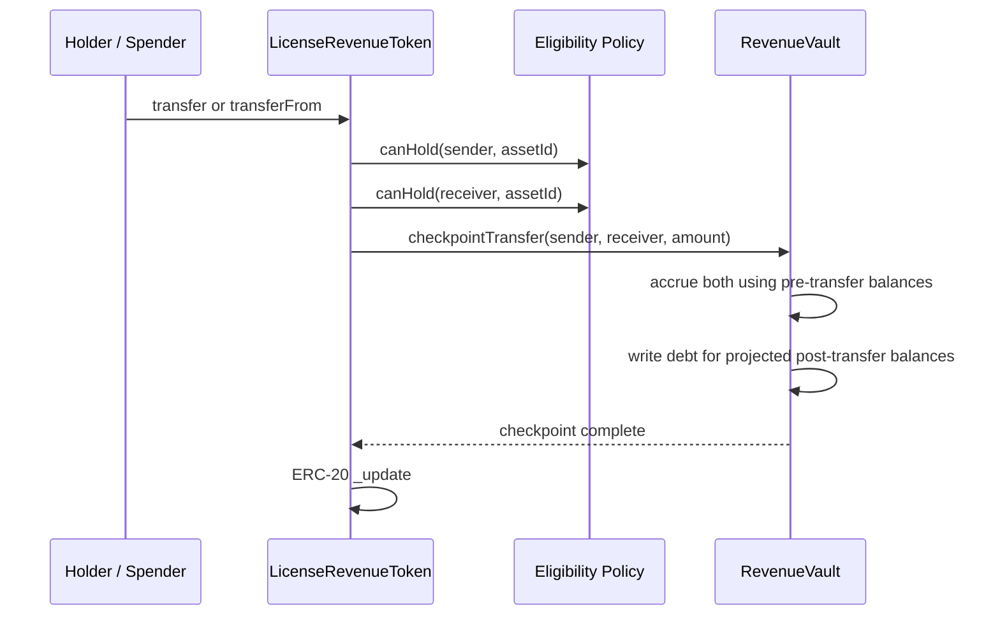

# Phase 3.1 Final Architecture and Security Review

**Status:** Architecture review complete  
**Date:** 2026-07-21  
**Scope:** `IdentityRegistry`, `RecoveryManager`, `LicenseRevenueToken`, and `RevenueVault`  
**Review basis:** Phase 3.1 implementation and design-freeze documents  
**Code changes:** None; this document records the implemented architecture and its remaining gaps

## 1. Executive assessment

Phase 3.1 establishes a coherent asset-level revenue-token accounting core:

- one `LicenseRevenueToken` is immutably bound to one IP asset and a fixed final supply;
- one `RevenueVault` is bound to that token and one settlement ERC-20;
- every token balance change passes through a pre-balance-update Vault checkpoint;
- claims use pull payments and cumulative reward-per-share accounting;
- full-wallet recovery is initiated by `RecoveryManager` and atomically migrates both token and reward state; and
- failed Token or Vault operations revert the complete recovery transaction.

The accounting core is internally consistent for the implemented trust model. It is not yet a complete production RWA issuance and settlement system. In particular, identity is not directly connected to recovery execution, old-wallet isolation is not enforced, revenue provenance is not registered, and no factory prevents duplicate active revenue programs for one asset. These are Phase 3.2 gates rather than assumptions that may be delegated to an operator.

## 2. Complete architecture diagram

```mermaid
flowchart TB
    subgraph Identity[Identity and business authorization]
        IA[Identity admin]
        IV[Identity verifier]
        IR[IdentityRegistry]
        EP[IInvestorEligibility policy]
        IA -->|revoke / role administration| IR
        IV -->|verify / suspend / restore| IR
        IR -. identity and ROLE_INVESTOR input expected .-> EP
    end

    subgraph Asset[IP asset layer]
        AR[IPAssetRegistry]
        NFT[IP Asset NFT / assetId]
        AR --- NFT
    end

    subgraph Recovery[Recovery authorization]
        RR[Requester]
        RV[Identity attestation verifier]
        RA[Approver]
        RG[Guardian]
        RE[Executor]
        RM[RecoveryManager]
        RR -->|EIP-712 destination consent + evidence| RM
        RV -->|attestation hash + expiry| RM
        RA -->|approve| RM
        RG -->|challenge| RM
        RE -->|authorizeExecution| RM
        IR -. not directly queried in Phase 3.1 .-> RM
    end

    subgraph RevenueProgram[One asset-level revenue program]
        TC[Token controller]
        MN[Minter]
        LRT[LicenseRevenueToken]
        VAULT[RevenueVault]
        ST[Settlement ERC-20]
        DEP[Authorized depositor]
        HOLDER[Eligible holder]

        TC -->|bind Vault and Manager; begin minting; activate| LRT
        MN -->|capped pre-activation mint| LRT
        EP -->|canHold account, assetId| LRT
        AR -->|immutable registry + assetId binding| LRT
        LRT -->|checkpointTransfer before every ordinary balance update| VAULT
        LRT -->|checkpointRecovery before recovery balance update| VAULT
        DEP -->|transferFrom + depositRevenue| VAULT
        ST -->|custody| VAULT
        HOLDER -->|transfer / transferFrom| LRT
        HOLDER -->|claim| VAULT
        VAULT -->|settlement payout| HOLDER
    end

    RM -->|executeRecoveryMigration: exact recoveryId, source, destination| LRT
```

Solid arrows are implemented calls or authority paths. Dotted arrows are intended identity-policy relationships that are not directly enforced by the current Phase 3.1 contracts.

### 2.1 Ordinary transfer sequence



### 2.2 Recovery sequence

```mermaid
sequenceDiagram
    participant E as Recovery Executor
    participant M as RecoveryManager
    participant T as LicenseRevenueToken
    participant P as Eligibility Policy
    participant V as RevenueVault

    E->>M: authorizeExecution(recoveryId)
    M->>M: validate role, separation, status, challenge deadline, expiries
    M->>M: status = ExecutionAuthorized
    M->>T: executeRecoveryMigration(recoveryId, source, destination)
    T->>M: isExecutionAuthorized(exact tuple)
    T->>P: canHold(destination, assetId)
    T->>T: read complete nonzero source balance
    T->>V: checkpointRecovery(source, destination, full balance)
    V->>V: accrue both; migrate pending; rewrite debt; check solvency
    V-->>T: RevenueStateMigrated
    T->>T: ERC-20 _update(source, destination, full balance)
    T-->>M: RecoveryMigrationExecuted
    M->>M: status = Executed; clear active request
```

Every call in the recovery sequence is part of one transaction. A revert at any point restores Manager status, Token balances and replay state, and Vault accounting.

## 3. Contract responsibilities

### 3.1 IdentityRegistry

`IdentityRegistry` is the canonical Phase 2 identity and business-role ledger. It:

- records application metadata commitments, requested roles, status, granted roles, verifier, and expiry;
- exposes current verification and business-role checks;
- supports verification, rejection, suspension, restoration, and permanent revocation;
- defines the business roles `ROLE_ASSET_OWNER`, `ROLE_LICENSEE`, `ROLE_INVESTOR`, `ROLE_VERIFIER`, and `ROLE_ARBITRATOR`; and
- prevents a verified identity from combining asset-owner status with verifier or arbitrator status.

Phase 3.1 boundary: neither `RecoveryManager` nor `LicenseRevenueToken` calls `IdentityRegistry` directly. The Token calls the abstract `IInvestorEligibility` policy, while RecoveryManager accepts an attestation from an AccessControl-authorized verifier. A production eligibility policy may use IdentityRegistry, but that adapter is not present in this repository.

### 3.2 RecoveryManager

`RecoveryManager` owns recovery authorization, not economic state. It:

- creates a request bound to chain, Manager, Token, source, destination, nonce, and evidence commitment;
- validates an EIP-712 signature from the destination;
- enforces one active request per `(token, source)` and monotonically increasing nonces;
- separates requester, verifier, approver, guardian, and executor permissions;
- records a verifier-provided identity attestation hash and expiry;
- enforces the approval, challenge-period, consent, attestation, and execution deadlines;
- exposes the exact tuple temporarily authorized for Token execution; and
- calls only the request's fixed Token, then marks the request executed if the entire Token/Vault migration succeeds.

It cannot mint Token supply, alter Vault reward records, deposit revenue, or claim settlement assets.

Implemented lifecycle:

```text
None -> Requested -> Verified -> Approved -> ExecutionAuthorized -> Executed
                    |            |
                    |            +-> Challenged
                    +--------------> Cancelled / Expired where allowed
```

`ExecutionAuthorized` is an in-transaction state used for the Token handshake. It is not a durable operator-controlled execution window.

### 3.3 LicenseRevenueToken

`LicenseRevenueToken` owns units, lifecycle, compliance checks, and balance-change classification. It:

- is immutably bound to an `IPAssetRegistry`, `assetId`, `finalSupply`, and eligibility policy;
- permanently binds one RevenueVault and one RecoveryManager while in `Created` state;
- permits capped minting only in `Minting` and activation only at exactly `finalSupply`;
- disables arbitrary burn and post-activation minting;
- routes mint, transfer, `transferFrom`, self-transfer, and recovery through OpenZeppelin 5.x `_update()`;
- checks ordinary sender and receiver eligibility, and recovery-destination eligibility;
- checkpoints Vault reward state before changing balances;
- accepts recovery only from its bound RecoveryManager and only for the Manager-authorized tuple; and
- records executed recovery IDs and asserts that recovery does not change total supply.

The Token represents funded revenue participation units. It does not convey IP ownership, a license, governance, redemption, principal protection, or guaranteed yield.

### 3.4 RevenueVault

`RevenueVault` owns settlement custody and revenue accounting. It:

- is immutably bound to one Revenue Token and one settlement ERC-20;
- accepts accounted deposits only from `REVENUE_DEPOSITOR_ROLE`;
- rejects zero deposits, zero Token supply, fee-on-transfer shortfalls, and deposits that would leave the Vault insolvent;
- distributes revenue with `accumulatedRewardPerShare` and a carried precision remainder;
- records each account's `rewardDebt` and `pendingReward`;
- permits only the bound Token to invoke transfer or recovery checkpoints;
- pays claims through a non-reentrant pull-payment flow;
- migrates the complete source reward ledger during full-balance recovery; and
- enforces `totalClaimed <= totalDeposited` and settlement-balance solvency.

Direct settlement-token transfers to the Vault are not accounted deposits and do not increase holder entitlement.

## 4. Permission matrix

### 4.1 Identity and recovery permissions

| Actor or role | Contract | Permitted actions | Material constraints |
|---|---|---|---|
| Any account | IdentityRegistry | Apply for identity | Nonzero requested roles; lifecycle rules apply |
| `VERIFIER_MANAGER_ROLE` | IdentityRegistry | Verify, reject, suspend, restore | Cannot grant conflicting owner/verifier or owner/arbitrator combinations |
| `DEFAULT_ADMIN_ROLE` | IdentityRegistry | Revoke identity; administer roles | Revocation is permanent in the implemented lifecycle |
| `RECOVERY_REQUESTER_ROLE` | RecoveryManager | Create recovery request | Exact nonce, evidence commitment, deadline, destination signature, no active request |
| `IDENTITY_VERIFIER_ROLE` | RecoveryManager | Record attestation hash and expiry | Must differ from requester |
| `RECOVERY_APPROVER_ROLE` | RecoveryManager | Approve verified request | Must differ from requester and verifier; starts challenge period |
| `RECOVERY_GUARDIAN_ROLE` | RecoveryManager | Challenge; cancel live request | Challenge blocks execution |
| Requester | RecoveryManager | Cancel its own live request | Cannot cancel a terminal request |
| Any account | RecoveryManager | Mark an elapsed live request expired | A relevant deadline must actually have elapsed |
| `RECOVERY_EXECUTOR_ROLE` | RecoveryManager | Execute approved request | Must be separate from requester, verifier, and approver; cannot modify parameters |
| `DEFAULT_ADMIN_ROLE` | RecoveryManager | Grant and revoke Manager roles | Does not automatically possess operational roles |

### 4.2 Token and Vault permissions

| Actor or role | Contract | Permitted actions | Material constraints |
|---|---|---|---|
| `TOKEN_CONTROLLER_ROLE` | LicenseRevenueToken | Bind Vault and Manager, begin minting, activate, administer minters | Bindings are one-time and Created-only; activation requires final supply |
| `MINTER_ROLE` | LicenseRevenueToken | Mint disclosed allocation | Minting lifecycle only; cannot exceed `finalSupply`; recipient must be eligible |
| Eligible holder or approved spender | LicenseRevenueToken | Transfer or `transferFrom` | Activated lifecycle; sender and receiver must pass `canHold`; Vault checkpoint must succeed |
| Bound RecoveryManager | LicenseRevenueToken | Execute exact full-balance recovery | Single-use recovery ID, authorized tuple, nonzero source balance, eligible destination |
| `REVENUE_DEPOSITOR_ROLE` | RevenueVault | Deposit accounted settlement revenue | Exact balance delta, nonzero Token supply, solvency check |
| Bound LicenseRevenueToken | RevenueVault | Transfer and recovery checkpoints | No EOA, admin, or RecoveryManager may call these directly |
| Account with claimable reward | RevenueVault | Claim its own reward | Pull payment only; no delegated claim recipient |
| `DEFAULT_ADMIN_ROLE` | RevenueVault | Administer depositor role | Cannot withdraw accounted funds or edit reward balances |

Business roles in IdentityRegistry and operational AccessControl roles are separate namespaces. Possessing `ROLE_INVESTOR`, for example, does not itself grant `MINTER_ROLE`, recovery execution, or deposit authority.

## 5. Economic invariants

### 5.1 Supply and program binding

```text
Activated => totalSupply == finalSupply

successful ordinary transfer or recovery:
totalSupplyBefore == totalSupplyAfter

one Token instance -> one immutable registry + assetId + eligibility policy
one Token instance -> one permanently bound RevenueVault
one Vault instance -> one immutable Token + settlement ERC-20
```

Arbitrary burn is disabled. Minting after activation is impossible. The repository does not yet enforce global uniqueness of one active Token/Vault program per asset; that is a Phase 3.2 factory responsibility.

### 5.2 Deposit and claim conservation

For a supported non-rebasing settlement token:

```text
0 <= totalClaimed <= totalDeposited

accountedVaultBalance = totalDeposited - totalClaimed

actualSettlementBalance >= accountedVaultBalance
```

Every successful deposit transfers funds and updates the accumulator atomically. Every successful claim clears the claimant's pending amount before transfer, increments `totalClaimed` exactly once, and rechecks solvency. A failed settlement transfer restores all state.

### 5.3 Accumulator accounting

For precision scalar `P`, deposit `D`, Token supply `S`, and carried remainder `R`:

```text
increment = floor(D * P / S) plus any carry from R
accumulatedRewardPerShare += increment
precisionRemainder = combined division remainder

accumulated(account, balance)
  = floor(balance * accumulatedRewardPerShare / P)

claimable(account)
  = pendingReward[account]
  + accumulated(account, currentBalance)
  - rewardDebt[account]
```

Deposits never iterate over holders. Division dust remains reserved in the Vault and cannot create liabilities beyond funded deposits.

### 5.4 Historical ownership

- A seller retains revenue accrued before a transfer.
- A buyer starts at the current accumulator and cannot claim the seller's historical interval.
- Destination rewards existing before recovery are additive and are never overwritten.
- Direct, unaccounted settlement-token transfers do not create holder liabilities.
- Claim order may affect bounded per-account rounding but cannot increase aggregate claims above deposits.

## 6. Recovery invariants

For source `s`, destination `d`, and successful recovery `r`:

```text
balanceAfter(s) == 0
balanceAfter(d) == balanceBefore(s) + balanceBefore(d)
totalSupplyAfter == totalSupplyBefore

pendingRewardAfter(s) == 0
rewardDebtAfter(s) == 0

unclaimedAfter(d)
  == unclaimedBefore(s) + unclaimedBefore(d)

accumulatedRewardPerShareAfter == accumulatedRewardPerShareBefore
precisionRemainderAfter == precisionRemainderBefore
totalDepositedAfter == totalDepositedBefore
totalClaimedAfter == totalClaimedBefore
vaultSettlementBalanceAfter == vaultSettlementBalanceBefore
```

Authorization and atomicity invariants:

- Recovery begins only through `RecoveryManager.authorizeExecution`.
- The Manager commits the Token, source, destination, nonce, evidence, and destination consent.
- The executor cannot substitute Token, source, destination, or amount.
- Only the complete current source balance is migratable.
- The Token accepts only its bound Manager and revalidates the exact in-flight tuple.
- The Vault accepts recovery checkpoints only from its bound Token.
- Manager request status, Token replay state, balances, Vault reward state, and events succeed or revert together.
- Manager lifecycle and Token-local `executedRecovery` both reject replay.
- A failed checkpoint does not consume the recovery ID.
- Recovery does not transfer settlement funds and cannot itself reduce Vault solvency.

## 7. Transfer checkpoint rules

All balance changes use the Token's single `_update()` extension point.

| Movement | Preconditions | Vault action before balance update | Post-checkpoint debt |
|---|---|---|---|
| Mint | `Minting`, capped supply, eligible receiver | Checkpoint receiver | Debt based on projected minted balance |
| Ordinary transfer | `Activated`, eligible sender and receiver | Accrue sender and receiver independently | Debt based on projected sender and receiver balances |
| `transferFrom` | ERC-20 allowance plus ordinary-transfer rules | Same as ordinary transfer | Same as ordinary transfer |
| Self-transfer | Ordinary lifecycle and eligibility rules | Accrue account once | Debt remains aligned to unchanged balance |
| Burn | Not permitted | None; transaction reverts | Not applicable |
| Recovery | Bound Manager, exact authorization, full nonzero source balance, eligible destination | Accrue both, move all source pending to destination, zero source state | Source debt zero; destination debt based on combined post-recovery balance |

Mandatory ordering:

```text
validate movement
  -> checkpoint using pre-change balances
  -> write projected post-change rewardDebt
  -> ERC-20 balance update
```

If the Vault call fails, Token balances do not move. If the subsequent ERC-20 update fails, the Vault checkpoint is reverted. Token-side checkpoint reentrancy protection and Vault-side `nonReentrant` protection prevent an interleaved balance change.

## 8. Known limitations

| Priority | Limitation | Security or economic consequence | Required disposition |
|---|---|---|---|
| Blocker | RecoveryManager does not query IdentityRegistry | Attestation-authorized roles are trusted to have performed identity continuity and `ROLE_INVESTOR` checks off-chain | Add direct execution-time identity/policy validation or a formally bound verifier adapter |
| Blocker | No source quarantine during the challenge period | Source can transfer tokens or claim rewards after approval; execution migrates only the then-current state | Add Token/Vault isolation keyed by active recovery and define cancellation/expiry release |
| Blocker | Recovered source is not permanently retired | If it remains eligible, it may later receive Token balances and participate again | Add per-program retired-wallet enforcement for inbound/outbound transfer and claim policy |
| Blocker | No program factory or global registry | Multiple active Token/Vault programs could be created for the same asset revenue stream | Add OfferingManager/ProgramRegistry uniqueness and activation controls |
| Blocker | Vault does not require Token lifecycle `Activated` | An authorized depositor can account revenue after partial minting if supply is merely nonzero | Gate deposits on program activation and `totalSupply == finalSupply` |
| Blocker | Deposits have no agreement or settlement reference | Funds are backed, but on-chain provenance and duplicate business-event detection are absent | Add a RevenueRouter with unique settlement IDs and asset/program validation |
| Policy gate | Claims do not check current identity or eligibility | An ineligible, suspended, or revoked holder with accrued rewards can still claim | Freeze the legal policy: preserve-but-pause, unrestricted earned claims, or recovery-only payout |
| High | Recovery execution is not restricted to `Activated` lifecycle | A valid Manager request can migrate an allocation during `Minting`; accounting remains atomic but the operational phase boundary is not enforced | Freeze the intended policy and add an explicit lifecycle gate |
| High | Recovery attestation hash semantics are not verified on-chain | Any nonzero hash from an authorized verifier satisfies the Manager | Define a typed attestation schema or verifier contract and bind it to request fields |
| High | RecoveryManager accepts any contract address as a requested Token | The Manager has no registered-program allowlist, although a real Token still checks its bound Manager | Restrict requests to ProgramRegistry-approved Tokens |
| High | No revenue-specific stateful invariant suite | Functional cases pass, but long random sequences of deposits, transfers, claims, and recoveries are not continuously proven | Add handler-based invariant and differential accounting tests |
| Medium | Vault recovery event omits `recoveryId` | Token and Vault events are correlated only by transaction and log ordering | Carry `recoveryId` through `checkpointRecovery` and index it in `RevenueStateMigrated` |
| Medium | No pause or legal-hold controls | Incidents cannot narrowly stop deposits, claims, transfers, or recovery while preserving other functions | Add independent, role-separated pause domains with explicit recovery behavior |
| Medium | AccessControl administration has no on-chain timelock or multisig requirement | A compromised admin can grant operational roles, even though it cannot bypass lifecycle checks in one call | Deploy behind governed role administration and document rotation procedures |
| Medium | Settlement-asset compatibility is configuration trust | Exact balance-delta checks reject many incompatible transfers, but there is no factory-level allowlist | Add chain-specific asset allowlisting and decimal/configuration validation |
| Medium | Challenged requests have no on-chain re-approval path | They can be cancelled but not adjudicated and restarted in place | Define legal-hold and re-approval semantics, normally with a new request and challenge period |
| Low | Manager binding does not explicitly validate interface support | Binding an incorrect address can permanently prevent recovery after leaving `Created` | Validate deployed code/interface during program creation and test deployment configuration |
| Low | Unsolicited settlement excess has no recovery process | Excess remains trapped, though it cannot dilute liabilities or mask insolvency in accounting | Add a delayed excess-only sweep that proves accounted funds remain covered |

This review does not classify the Revenue Token legally, validate an offering document, audit an off-chain identity provider, or assess deployment key custody.

## 9. Phase 3.2 prerequisites

### 9.1 Required architecture decisions

Before Phase 3.2 Solidity implementation begins, freeze:

1. the `OfferingManager` or `ProgramRegistry` lifecycle and the uniqueness key for `(IPAssetRegistry, assetId)`;
2. who may create and activate a program, including current IP NFT ownership and active `ROLE_ASSET_OWNER` checks;
3. the production `IInvestorEligibility` policy and its direct relationship to IdentityRegistry;
4. whether an ineligible holder may claim already-earned revenue;
5. source quarantine, permanent retirement, cancellation, legal hold, and recovery re-approval semantics;
6. the eligible revenue-share formula, fee ordering, settlement asset, and cutover timestamp;
7. the unique agreement/settlement identifier used to prevent business-event replay; and
8. independent pause roles and which operations remain available under each pause.

### 9.2 Required integration modules

- `OfferingManager` or `RevenueProgramRegistry` for one-program-per-asset enforcement.
- A production IdentityRegistry-backed investor eligibility policy.
- A `RevenueRouter` or LicenseEscrow settlement adapter that deposits the disclosed revenue share atomically.
- Token/Vault recovery isolation and retired-wallet enforcement.
- A typed recovery-verifier interface or directly verifiable identity attestation.
- Program activation checks in RevenueVault.
- Correlated settlement and recovery events carrying program, agreement, and recovery identifiers.

### 9.3 Verification gates

Phase 3.2 should not be accepted until the suite proves:

- no duplicate active program for the same IP asset;
- no pre-activation or wrong-program deposit;
- each successful Escrow settlement is routed and accounted at most once;
- failed settlement routing reverts the Escrow/Vault effects atomically;
- source transfer, inbound transfer, allowance use, claim, and competing recovery behavior match the frozen isolation policy;
- execution-time identity, eligibility, consent, attestation, and holding-limit checks fail closed;
- random sequences preserve supply, entitlement conservation, `totalClaimed <= totalDeposited`, and Vault solvency;
- pause and role-administration transitions cannot erase balances or accrued rewards; and
- event streams are sufficient to reconstruct every program deposit, claim, transfer checkpoint, and recovery without plaintext PII.

## 10. Final review conclusion

Phase 3.1 is suitable as the accounting and recovery foundation for Phase 3.2. Its strongest property is the atomic Token/Vault checkpoint boundary: historical rewards follow economic ownership rules across transfers, and complete reward state follows the beneficial owner during governed recovery without changing global funds or supply.

Phase 3.2 must treat identity enforcement, program uniqueness, revenue provenance, source isolation, and invariant testing as protocol controls. They are not optional deployment configuration and must not be represented as already enforced by the current contracts.
