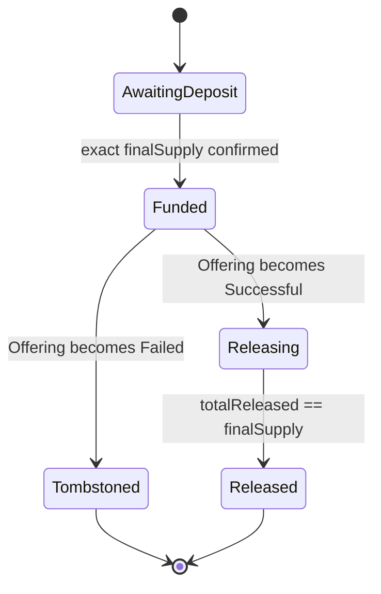
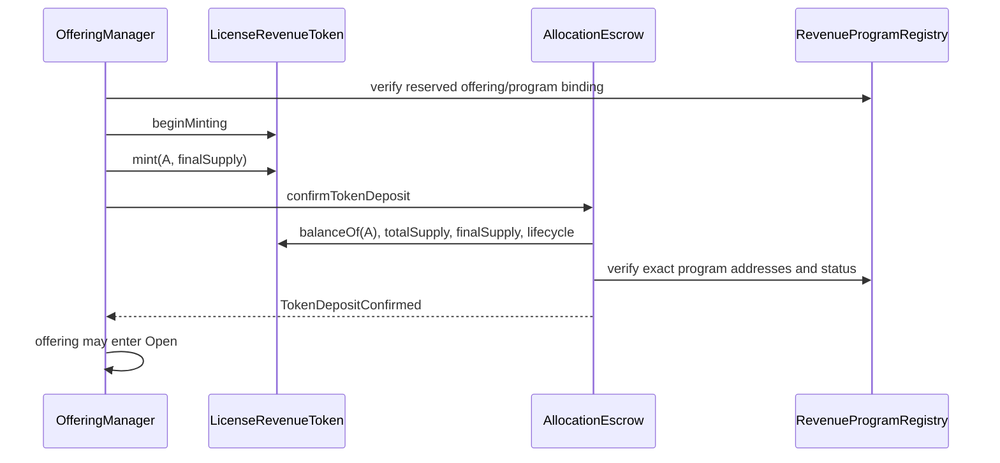

# Phase 3.2-1B AllocationEscrow Design Freeze

**Status:** Design freeze  
**Date:** 2026-07-21  
**Scope:** Pre-activation Revenue Token custody, immutable allocation records, and successful-offering delivery  
**Implementation:** No Solidity changes in Phase 3.2-1B Design Freeze

## 1. Purpose and boundary

`AllocationEscrow` holds the complete pre-minted `LicenseRevenueToken.finalSupply` from offering opening until a successful offering delivers every recorded allocation.

```text
LicenseRevenueToken mint
        -> AllocationEscrow custody
        -> Offering subscriptions recorded
        -> post-close identity reconciliation
        -> Successful
        -> exact allocation delivery
        -> Token activation
```

AllocationEscrow has no beneficial ownership of the Token. It is a custody and delivery enforcement boundary, not an investor, issuer reserve, Token controller, pricing engine, recovery authority, or source of offering success truth.

It never:

- accepts or refunds USDC;
- calculates price or USDC cost;
- chooses investors or allocation order;
- declares an offering successful or failed;
- activates the Revenue Token;
- deposits into RevenueVault;
- changes `totalSupply`;
- performs wallet recovery; or
- exposes a generic owner withdrawal or rescue function.

## 2. Decisions at a glance

| Topic | Frozen v1 decision |
|---|---|
| Custody scope | One Escrow serves one `offeringId` and one Revenue Token |
| Deposit | Complete `finalSupply` is minted directly to Escrow once before Offering opens |
| Allocation source | OfferingManager registers the exact FCFS-filled allocation after a funded subscription succeeds |
| Allocation mutability | Subscription ID, destination, amount, and sequence are immutable once registered |
| Release state | Release is possible only while OfferingManager reports `Successful` |
| Release authority | Only the immutable OfferingManager may call Escrow release functions |
| Delivery trigger | Investor/relayer may request delivery through OfferingManager; Escrow never trusts them directly |
| Failure | Failed offering permanently tombstones the Escrowed Token; no release, burn, rescue, recovery, or activation |
| Activation | OfferingManager may activate only after Escrow proves all `finalSupply` was delivered |
| Oversubscription | Manager computes FCFS partial fill; Escrow enforces only the immutable accepted fill |

## 3. Token custody responsibility

AllocationEscrow is responsible for preserving the physical Token units required to satisfy all successful primary allocations.

Its immutable binding includes:

```text
offeringManager
offeringId
revenueProgramRegistry
revenueToken
assetRegistry
assetId
finalSupply
```

The Escrow validates that these values match the registered revenue program. It must not accept a later Token substitution, OfferingManager replacement, asset reassignment, or supply change.

### 3.1 Custody phases



These may be explicit Escrow states or derived from local accounting plus OfferingManager state. The semantic boundaries are mandatory.

### 3.2 No economic participation

Before Token activation, RevenueVault deposits are forbidden. Therefore the Escrow balance must not accrue funded revenue. If revenue accounting is nonzero before release completes, opening/finalization fails closed.

After complete release, Escrow Token balance is zero. It cannot retain an undisclosed Token position that later earns revenue.

## 4. Deposit flow

### 4.1 One-time direct mint

The Token is minted directly to AllocationEscrow; it is not minted to an EOA and transferred later.



The Escrow cannot rely on an ERC-20 receiver callback because standard ERC-20 mint and transfer provide no receiver hook. `confirmTokenDeposit` records custody only after reading and validating on-chain Token state.

### 4.2 Deposit requirements

Before marking the Escrow funded:

- caller is the immutable OfferingManager;
- offering is still `Draft` and has not opened;
- RevenueProgramRegistry reservation matches the Escrow and Token;
- Token lifecycle is the pre-activation minting state;
- `Token.finalSupply()` equals the immutable Escrow `finalSupply`;
- `Token.totalSupply()` equals `finalSupply`;
- `Token.balanceOf(address(AllocationEscrow))` equals `finalSupply`;
- no allocation has been registered or released;
- RevenueVault has no accounted deposits; and
- deposit confirmation has not occurred before.

Any mismatch reverts opening. A partial deposit cannot be topped up after the offering opens.

### 4.3 Unexpected Token receipts

The Escrow has no generic deposit entry point. Any unsolicited or wrong-token transfer:

- does not increase available allocation;
- does not change `finalSupply` or registered totals;
- does not authorize release; and
- cannot be swept through a function that risks the bound Revenue Token.

A future wrong-token recovery mechanism may move only an unrelated token and must prove the bound Revenue Token balance remains sufficient. It is excluded from v1 unless separately audited.

## 5. Allocation storage model

### 5.1 Canonical record

OfferingManager is the canonical subscription and eligibility state machine. AllocationEscrow stores a defensive immutable delivery record so a later Manager call cannot substitute destination or amount.

Conceptually:

```text
Allocation {
    subscriptionId
    investorCommitment
    destination
    tokenAmount
    sequence
    status: Registered | Released
}
```

Storage commitments:

```text
allocationHash[subscriptionId]
allocationStatus[subscriptionId]
totalRegistered
totalReleased
nextSequence
depositConfirmed
```

`investorCommitment` is a hash or protocol identifier, not plaintext PII.

### 5.2 Registration rules

`registerAllocation` is called only by OfferingManager as part of a successfully funded subscription transaction. It requires:

- Escrow deposit is confirmed;
- Offering state is `Open` in the Funding subphase;
- `subscriptionId` is nonzero, domain-separated, and unused;
- destination is nonzero and matches the Manager record;
- amount is nonzero and respects the immutable allocation lot;
- sequence equals `nextSequence`;
- `totalRegistered + amount <= finalSupply`; and
- the Manager reports the exact subscription tuple as committed.

After registration, subscription ID, destination, amount, investor commitment, and sequence cannot be edited or deleted.

If the USDC transfer or any later step in the subscription transaction fails, allocation registration reverts with it. The Manager and Escrow must never disagree about a funded subscription.

### 5.3 Reconciliation outcome

Post-close identity reconciliation remains in OfferingManager. AllocationEscrow does not rewrite registered records when an investor becomes ineligible.

- If every registered allocation remains eligible and totals `finalSupply`, the offering becomes `Successful` and all records are releasable.
- If any commitment is excluded, eligible sold supply is below `finalSupply`, the v1 offering becomes `Failed`, and no record is releasable.

This binary v1 model avoids partial successful sets and administrative reassignment of excluded Token units.

## 6. FCFS allocation execution

### 6.1 Ordering responsibility

OfferingManager calculates FCFS fills using transaction order:

```text
remaining = finalSupply - committedSupply
filled = min(requestedAmount, remaining)
```

AllocationEscrow does not recalculate `filled`, reorder subscriptions, run an auction, or perform pro-rata settlement. It enforces the Manager result by requiring:

```text
sequence == nextSequence
tokenAmount == Manager.committedAllocation(subscriptionId)
totalRegisteredAfter <= finalSupply
```

`nextSequence` increments only after successful registration. A reverted subscription consumes neither sequence nor supply.

### 6.2 Atomic subscription handshake

The future OfferingManager/OfferingEscrow/AllocationEscrow subscription flow must be atomic:

```text
1. validate identity, eligibility, time, requestedAmount, minFill, and capacity
2. compute filled and exact USDC cost
3. transfer exact USDC into OfferingEscrow
4. record Manager subscription and aggregate commitment
5. register immutable AllocationEscrow record
6. emit correlated subscription/allocation events
```

A revert in any step restores USDC custody, Manager totals, Escrow record, sequence, and remaining capacity.

### 6.3 No pre-success delivery

Registration is not delivery. While OfferingManager is `Open`, the full Revenue Token balance remains in AllocationEscrow even when `totalRegistered == finalSupply`.

Full commitment merely stops further subscriptions. Delivery waits until post-close identity reconciliation derives `Successful`.

## 7. `minFill` behavior

`minFill` protects an investor from accepting an unexpectedly small FCFS partial allocation.

For requested Token amount `requested`, available amount `remaining`, and investor threshold `minFill`:

```text
candidateFill = min(requested, remaining)

require requested > 0
require minFill > 0
require minFill <= requested
require requested % allocationLot == 0
require minFill % allocationLot == 0
require candidateFill % allocationLot == 0
require candidateFill >= minFill
```

If the checks pass:

- exactly `candidateFill` is registered;
- only its exact USDC cost is transferred;
- no separate excess-USDC refund is created; and
- the unused requested amount has no later priority or reservation.

If `candidateFill < minFill`, the entire subscription reverts. It creates no allocation, pulls no USDC, changes no aggregate, and consumes no sequence number.

Examples with an allocation lot of one Token:

| Requested | Remaining | `minFill` | Result |
|---:|---:|---:|---|
| 100 | 100 or more | 100 | Fill 100 |
| 100 | 40 | 25 | Fill 40 |
| 100 | 40 | 50 | Revert |
| 100 | 0 | 1 | Revert: sold out |

`minFill` affects acceptance only. It cannot change FCFS order, price, final supply, or the successful allocation amount after registration.

## 8. Successful release rules

### 8.1 Required authority and state

Only OfferingManager calls AllocationEscrow release. A relayer or investor may call a permissionless delivery function on OfferingManager, but the resulting Escrow caller remains the immutable Manager.

For `releaseAllocation(subscriptionId)`, Escrow verifies:

- deposit was confirmed;
- OfferingManager reports `Successful` for the immutable offering ID;
- RevenueProgramRegistry binding and status still match;
- stored allocation exists and is `Registered`;
- Manager returns the same destination and amount;
- destination passes execution-time identity and offering eligibility;
- Token is still in the permitted pre-activation allocation lifecycle;
- allocation has not already been released;
- `totalReleased + amount <= finalSupply`; and
- Token balance is sufficient.

### 8.2 Checks-effects-interactions

Release follows CEI and is non-reentrant:

```text
validate exact immutable allocation
  -> mark allocation Released
  -> increment totalReleased
  -> invoke Token controlled pre-activation delivery
  -> verify resulting custody balance/reconciliation
  -> emit AllocationReleased
```

If Token delivery fails, status and `totalReleased` revert. There is no success event or consumed allocation.

### 8.3 Controlled Token path

The current `LicenseRevenueToken` rejects ordinary transfers before activation. Phase 3.2 implementation requires a dedicated pre-activation allocation entry point with these properties:

- callable only through the registered AllocationEscrow/OfferingManager handshake;
- exact offering, subscription, destination, and amount validation;
- no allowance-based or arbitrary Escrow transfer;
- destination eligibility checked at execution;
- total supply unchanged;
- Vault checkpoint remains mandatory through `_update()`;
- RevenueVault accounted deposits must still be zero;
- no historical reward can accrue to Escrow or receiver before activation; and
- path permanently disabled once Token activates or offering fails.

It must not reuse the RecoveryManager path. Primary allocation and beneficial-owner recovery have different authorization, lifecycle, and accounting meanings.

### 8.4 Batch and liveness behavior

Delivery may occur one allocation at a time or in bounded batches. A single invalid item must either revert the whole explicitly atomic batch or be handled through a documented per-item method; silent skipping is forbidden.

Permissionless callers may advance delivery through OfferingManager using immutable records. This prevents an operator from holding successful allocations hostage without granting callers freedom to change parameters.

## 9. Failed offering handling

When OfferingManager reports `Failed`, AllocationEscrow enters permanent `Tombstoned` semantics:

- `totalReleased` must be zero;
- no allocation is deliverable;
- the Token remains non-activated;
- the complete `finalSupply` remains visibly held by Escrow;
- no burn or redemption occurs;
- no generic rescue or admin withdrawal exists;
- no new allocation is registered; and
- no later state may reopen or finalize the offering.

### 9.1 Recovery bypass prohibition

The current RecoveryManager-driven Token path can migrate a source's complete balance and is not yet restricted to activated investor wallets. A failed AllocationEscrow must not be treated as a lost investor wallet.

Phase 3.2 implementation must therefore enforce at Token/ProgramRegistry level:

```text
registered AllocationEscrow source
  => RecoveryManager migration prohibited

Failed offering Token
  => all allocation, recovery, transfer, activation, and Vault-deposit paths prohibited
```

AllocationEscrow cannot enforce this alone because Token balances are controlled by the Token contract. Tombstone protection is an integration prerequisite, not an operational promise.

### 9.2 Audit preservation

Failure does not delete allocation records. Events and read functions continue to show:

- the full pre-mint;
- FCFS registration order;
- committed destinations and amounts;
- failure reason/evidence commitment; and
- zero released supply.

No event should imply that tombstoned Token units were burned or returned to the issuer.

## 10. Token activation dependency

AllocationEscrow never activates the Token. It exposes reconciliation facts used by OfferingManager:

```text
depositConfirmed == true
totalRegistered == finalSupply
totalReleased == finalSupply
Token.balanceOf(AllocationEscrow) == 0
all registered allocations Released
offering state == Successful
```

Only after all equalities hold may OfferingManager atomically:

1. call `LicenseRevenueToken.activate()`;
2. mark RevenueProgramRegistry active;
3. transition OfferingManager to `Finalized`;
4. enable successful OfferingEscrow proceeds withdrawal; and
5. open the RevenueVault active-program deposit gate.

If activation or any dependent transition fails, OfferingManager remains `Successful`. Released investor balances remain pre-activation and cannot transfer or receive Vault revenue until finalization is retried successfully.

Activation cannot occur when:

- Escrow was never exactly funded;
- any allocation is unresolved;
- any Token remains in Escrow;
- total released differs from `finalSupply`;
- offering is `Open` or `Failed`;
- Token/Vault/Registry bindings differ; or
- RevenueVault already contains accounted deposits.

## 11. Access control

### 11.1 Minimal authority model

| Caller | Permitted Escrow action | Restrictions |
|---|---|---|
| Immutable OfferingManager | Confirm deposit, register allocation, release allocation, record tombstone | Every action still checks Manager state and exact program tuple |
| Investor or relayer | No direct state-changing Escrow authority | May trigger Manager delivery for an immutable allocation |
| Issuer/SPV | Read-only | Cannot withdraw, redirect, release, burn, or activate |
| Platform admin | Read-only unless acting through valid Manager lifecycle role | No Escrow owner escape hatch |
| RecoveryManager | None | Allocation custody is not wallet recovery |
| RevenueProgramRegistry | Read-only validation source | Does not transfer Token |

### 11.2 Deployment and upgrade boundary

The preferred v1 Escrow has immutable program bindings and no mutable owner. If deployed through a factory or proxy, initialization is single-use and upgrades cannot introduce an economic withdrawal without the same governance and migration guarantees as a new custody design.

There is no role that can:

- alter a registered allocation;
- substitute destination or amount;
- release while `Open` or `Failed`;
- make a partial failed-offering rescue;
- mark an allocation released without moving Token; or
- reduce the custody amount used by activation checks.

### 11.3 Reentrancy boundary

Registration and release are non-reentrant. Token delivery may call RevenueVault checkpoint logic, so Escrow, Token, and Vault locks must allow the intended linear call graph while rejecting reentry into another registration, release, recovery, or activation.

## 12. Events and observability

```text
TokenDepositConfirmed(
  offeringId,
  revenueToken,
  finalSupply
)

AllocationRegistered(
  offeringId,
  subscriptionId,
  sequence,
  investorCommitment,
  destination,
  tokenAmount
)

AllocationReleased(
  offeringId,
  subscriptionId,
  sequence,
  destination,
  tokenAmount
)

AllocationEscrowTombstoned(
  offeringId,
  revenueToken,
  retainedTokenAmount,
  reasonCode,
  evidenceHash
)
```

The Token also emits its standard direct `Transfer(AllocationEscrow, destination, amount)` during successful delivery. It must not emit synthetic burn/mint events for allocation movement.

Events contain no plaintext identity documents. `subscriptionId` and `investorCommitment` provide auditable correlation with OfferingManager and future OfferingEscrow events.

## 13. Invariants

### 13.1 Binding invariants

```text
one AllocationEscrow -> one offeringId
one AllocationEscrow -> one Revenue Token
one AllocationEscrow -> one immutable OfferingManager
Escrow finalSupply == Token finalSupply == registered program finalSupply
```

### 13.2 Custody conservation

After deposit confirmation and before tombstone/final completion:

```text
Token.balanceOf(AllocationEscrow) + totalReleased == finalSupply
Token.totalSupply == finalSupply
```

Registration changes no Token balance. Release changes ownership but not `totalSupply`.

### 13.3 Allocation conservation

```text
sum(registered allocation amounts) == totalRegistered
sum(released allocation amounts) == totalReleased

0 <= totalReleased <= totalRegistered <= finalSupply

Released allocation => exactly one Token delivery
Registered allocation => zero or one Token delivery
```

No subscription ID or sequence is registered twice. A failed call consumes neither.

### 13.4 State invariants

```text
Open       => totalReleased == 0
Successful => releases may occur
Failed     => totalReleased == 0 forever
Finalized  => totalReleased == totalRegistered == finalSupply
```

Tombstoned and Released custody states are terminal.

### 13.5 FCFS and `minFill` invariants

- registration sequence equals successful subscription order;
- cumulative registered allocation never exceeds remaining supply;
- partial fill is accepted only when `filled >= minFill`;
- failed `minFill` creates no USDC movement or allocation record;
- accepted partial fill reserves no future remainder; and
- Escrow cannot reorder or resize Manager-committed allocations.

### 13.6 Outcome exclusivity

```text
successful allocation delivery
  => no failed-offering refund for that subscription

Failed offering
  => no allocation delivery, Token activation, recovery migration, or issuer Token rescue
```

### 13.7 Economic isolation

```text
USDC held by AllocationEscrow == 0
RevenueVault accounted deposits before Finalized == 0
claimable reward attributable to Escrow before Finalized == 0
```

AllocationEscrow Token is custody inventory, not revenue-bearing beneficial ownership.

### 13.8 Atomicity and replay

- subscription funding, Manager accounting, and allocation registration succeed or revert together;
- allocation status, total released, and Token delivery succeed or revert together;
- the same allocation cannot release twice;
- failure/tombstone cannot be reversed;
- Token callback or Vault checkpoint failure leaves custody and release state unchanged; and
- reentrancy cannot interleave release, activation, or recovery.

## 14. Required implementation tests for Phase 3.2-1B

Before integration with real USDC, tests must cover:

- only immutable OfferingManager can confirm deposit, register, release, or tombstone;
- partial or wrong-Token deposit cannot be confirmed;
- exact full-supply direct mint can be confirmed once;
- offering cannot open before confirmed custody;
- duplicate subscription ID and sequence rejected;
- zero, misaligned, substituted, and over-cap allocation rejected;
- registration changes no Token balance;
- no release during `Draft` or `Open`;
- exact release succeeds only in `Successful`;
- destination or amount substitution rejected;
- destination eligibility is rechecked;
- release replay rejected;
- bounded batch behavior is deterministic;
- Token delivery failure rolls back allocation status and totals;
- all released supply reconciles exactly to `finalSupply`;
- Token activation rejected while any allocation remains unresolved;
- `Failed` permanently blocks release, activation, ordinary transfer, and RecoveryManager bypass;
- failure records remain queryable with zero released supply; and
- custody, allocation, total-supply, and no-reward invariants hold under random registration/release sequences.

No test in this phase transfers real USDC. OfferingEscrow and subscription-payment accounting belong to Phase 3.2-1C.

## 15. Deferred decisions

The following are outside v1 and require separate design freezes:

- soft-cap offerings or successful partial sale;
- issuer-retained or unsold active allocation;
- pro-rata oversubscription;
- auction or allowlist-batch ordering;
- vesting, lockups, or staged Token delivery;
- secondary-market custody;
- failed-Token burn or migration;
- cross-chain allocation; and
- upgrade-time Escrow migration.

They cannot be added through an administrator setting without changing the frozen economic model.
