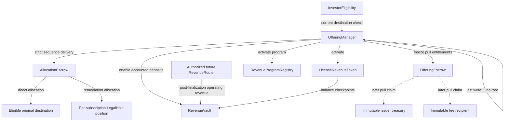

# Phase 3.2-2F0 Atomic Finalization Design Freeze

**Status:** Design freeze  
**Date:** 2026-07-27  
**Scope:** Successful-offering finalization, remediation custody, activation, and proceeds entitlement  
**Implementation:** No Solidity changes in Phase 3.2-2F0

## 1. Purpose and frozen boundary

Finalization is the single atomic boundary that converts a successfully reconciled
primary offering into an active revenue program.

```text
Successful
  -> every subscription receives a terminal delivery disposition
  -> all Token units leave AllocationEscrow
  -> Revenue Token activates
  -> revenue program activates
  -> RevenueVault starts accepting accounted operating revenue
  -> primary-offering proceeds become claimable
  -> Offering becomes Finalized
```

Finalization does not transfer USDC to the issuer or fee recipient. It creates
fixed pull-payment entitlements. It also does not resolve a remediation case,
replace an investor wallet, deposit offering proceeds into RevenueVault, or
perform Token recovery.

This document freezes the target architecture for later implementation phases:

- Phase 3.2-2F1: remediation and legal-hold custody;
- Phase 3.2-2F2: Token, program, and Vault activation; and
- Phase 3.2-2F3: proceeds entitlement and the atomic `Finalized` transition.

The repository does not currently contain a `RevenueProgramRegistry`, and the
current `RevenueVault` is not activation-gated. Those components are required
before finalization can be implemented safely.

## 2. Decisions at a glance

| Topic | Frozen decision |
|---|---|
| Finalization trigger | Permissionless after all deterministic prerequisites pass |
| Failed offering | Permanently ineligible for finalization |
| Direct allocation | Delivered to the immutable subscription destination |
| Remediation allocation | Delivered to an isolated legal-hold position, never to an administrator |
| Legal-hold granularity | One deterministic position per remediation subscription |
| Completion equation | `directReleased + legalHoldTransferred == finalSupply` |
| AllocationEscrow at finalization | Zero Revenue Token balance |
| Token lifecycle before/after | Exactly `Minting -> Activated` |
| Program lifecycle before/after | Exactly `Reserved -> Active` |
| Vault lifecycle before/after | Revenue deposits disabled -> enabled |
| OfferingEscrow | Locked proceeds -> fixed pull-payment entitlements |
| Payout during finalization | None |
| Offering status write | `Successful -> Finalized` only after every dependency succeeds |
| Failure behavior | Any failed call or postcondition reverts the complete transaction |

## 3. Complete target architecture



The two cash flows remain separate:

```text
primary capital:
Investor -> OfferingEscrow -> issuer/fee pull entitlement

future operating revenue:
RevenueRouter -> RevenueVault -> Revenue Token holder claim
```

Offering proceeds must never be treated as RevenueVault revenue.

## 4. Finalization prerequisites

`finalizeOffering(offeringId)` must revert unless every prerequisite below is
true at execution time.

### 4.1 Offering and reconciliation

- The Offering exists.
- Its current status is exactly `Successful`.
- It is not `Failed`, tombstoned, already `Finalized`, or in a retry-unsafe
  intermediate state.
- `reconciledCount == nextSequence`.
- `validSoldSupply == finalSupply`.
- `validCommittedUSDC == committedUSDC`.
- Every sequence in `[0, nextSequence)` has been processed exactly once by the
  delivery/remediation workflow.
- No subscription remains `Committed`, `Invalid`, or otherwise lacks a terminal
  delivery disposition.

### 4.2 Frozen dependency bundle

The Manager must revalidate the immutable addresses recorded in the Offering:

- `LicenseRevenueToken`;
- `AllocationEscrow`;
- legal-hold factory or registry;
- `OfferingEscrow`;
- `RevenueVault`;
- `RevenueProgramRegistry`;
- investor eligibility policy;
- settlement ERC-20;
- issuer treasury;
- fee recipient; and
- future authorized revenue depositor/router.

Every dependency must still bind back to the same Manager, Offering, Token,
asset, and settlement asset. Finalization cannot accept replacement parameters.

### 4.3 Token and allocation custody

- Token lifecycle is exactly `Minting`.
- `totalSupply == finalSupply`.
- Token is bound to the Offering's AllocationEscrow, RevenueVault, RecoveryManager,
  and eligibility policy.
- `AllocationEscrow.depositConfirmed == true`.
- `AllocationEscrow.tombstoned == false`.
- `directReleased + legalHoldTransferred == finalSupply`.
- `AllocationEscrow Token balance == 0`.
- The sum of immutable per-subscription allocation amounts equals `finalSupply`.

### 4.4 USDC custody

- `OfferingEscrow.refundable == false`.
- `OfferingEscrow.totalRefunded == 0`.
- `OfferingEscrow.totalContributed == committedUSDC`.
- Its actual USDC balance covers all unclaimed issuer and fee entitlements.
- OfferingManager holds zero settlement Token.
- Neither issuer nor fee recipient has received proceeds through finalization.

### 4.5 Program and Vault

- The program slot is exactly `Reserved` for this Offering, Token, Vault, registry,
  and `assetId`.
- No other active program exists for the same uniqueness key.
- RevenueVault deposits are currently disabled.
- RevenueVault is bound to the exact Revenue Token and operating-revenue
  settlement asset.
- No accounted operating-revenue deposit has occurred before activation.

## 5. Delivery completion definition

Finalization distinguishes beneficial delivery from custody completion.

### 5.1 Direct delivery

A direct delivery is complete only when:

- reconciliation classified the subscription as `Valid`;
- the original destination passed the delivery-time eligibility check;
- AllocationEscrow released exactly the frozen amount to that destination;
- the allocation is marked directly released once; and
- the Token transfer and RevenueVault checkpoint both succeeded.

The caller cannot supply a destination or amount.

### 5.2 Remediation/legal-hold delivery

A remediation delivery is complete for finalization only when:

- the subscription was valid at successful outcome resolution but its original
  destination failed the later delivery-time check, or an already frozen
  post-success remediation reason exists;
- exactly the original allocation amount moved from AllocationEscrow into the
  deterministic legal-hold position for that subscription;
- the position records the immutable `offeringId`, `subscriptionId`, original
  destination, amount, and reason;
- the position is registered as a non-beneficial system custodian; and
- the allocation is marked legal-held once.

Merely setting `SubscriptionStatus.Remediation` is not custody completion.
Tokens remaining in AllocationEscrow do not count as delivered.

### 5.3 Completion accounting

The frozen equations are:

```text
totalDelivered
  = directReleased
  + legalHoldTransferred

totalDelivered == finalSupply

AllocationEscrow Token balance
  = finalSupply - totalDelivered

Finalized => AllocationEscrow Token balance == 0
```

`totalReleased` in the current AllocationEscrow represents direct delivery.
Phase 3.2-2F1 must add separate legal-hold and total-delivered accounting rather
than silently changing the meaning of historical direct-release records.

## 6. Remediation allocation custody model

### 6.1 Selected model: isolated position per subscription

Each remediation subscription receives a deterministic, isolated legal-hold
position, preferably a minimal clone created from:

```text
chainId
OfferingManager
offeringId
subscriptionId
revenueToken
```

One shared omnibus Token balance is not selected for v1. The current recovery
accounting migrates complete account balances, while an omnibus escrow would
require partial Token and partial RevenueVault reward-ledger migration. Isolated
positions keep one legal beneficiary, one Token balance, and one reward state
per source account.

### 6.2 Immutable position record

Each position freezes:

- `offeringManager`;
- `offeringId`;
- `subscriptionId`;
- `revenueToken`;
- original beneficial destination;
- original allocation amount;
- remediation reason;
- creation/deposit timestamp; and
- legal-hold release status.

The position must not expose owner withdrawal, rescue, arbitrary transfer, burn,
delegated approval, activation, or generic call functionality.

### 6.3 Deposit authorization

- Only the bound AllocationEscrow may fund the position.
- Only the exact frozen allocation amount is accepted.
- Deposit confirmation is one-time.
- The position must be an eligible system custodian under the Token policy.
- AllocationEscrow updates its legal-hold accounting only if the Token movement
  succeeds.

### 6.4 Economic ownership and post-activation revenue

Legal hold changes custody, not beneficial ownership. The original subscription
remains the legal entitlement reference.

Because a legal-hold position becomes a Token holder after activation, it may
accrue RevenueVault rewards. A later remediation release must therefore move:

```text
complete Token balance
+ complete pending RewardVault state
```

to the approved destination atomically. A plain ERC-20 transfer is insufficient
because transfer checkpoints leave historical rewards with the sender.

Phase 3.2-2F1 must define a dedicated, replay-protected legal-hold release
authorization domain that reuses the Token/Vault full-state migration semantics
without pretending that the system custodian is a lost user wallet. The source
position must end with zero Token balance, zero pending reward, and zero
`rewardDebt`.

### 6.5 Beneficiary replacement

An administrator cannot substitute a destination during delivery or finalization.
Release to the original destination requires current eligibility.

If lawfully replacing the original wallet is necessary, a separate remediation
or recovery process must prove identity continuity, destination consent, current
eligibility, nonce uniqueness, and challenge completion. The replacement is not
a parameter of `finalizeOffering`.

## 7. Token activation order

Token activation occurs only inside the atomic finalization transaction and only
after delivery completion is proven.

Required preconditions:

```text
Token.lifecycle == Minting
Token.totalSupply == Token.finalSupply
AllocationEscrow.balance == 0
directReleased + legalHoldTransferred == finalSupply
```

Then OfferingManager calls the existing controller-only `activate()`.

Required postconditions:

```text
Token.lifecycle == Activated
Token.totalSupply == finalSupply
```

Activation permanently:

- disables minting;
- disables the pre-activation primary-delivery path;
- enables ordinary eligibility-restricted transfers; and
- preserves total supply.

No standalone public Manager endpoint may activate the Token without executing
the entire finalization transaction.

## 8. RevenueProgramRegistry activation

### 8.1 Required registry

A production `RevenueProgramRegistry` is a Phase 3.2-2F prerequisite. The
repository does not currently implement it.

The uniqueness key is:

```text
keccak256(IPAssetRegistry, assetId)
```

At minimum, the Registry records:

- asset registry and `assetId`;
- OfferingManager and `offeringId`;
- Revenue Token;
- RevenueVault;
- issuer;
- program status;
- reservation and activation timestamps; and
- failed/tombstoned status where applicable.

### 8.2 Lifecycle

```text
None -> Reserved -> Active
                   ^
Reserved -> Failed |
```

- Offering creation/opening reserves the exact program tuple.
- Failed offerings permanently tombstone their failed Token/Vault pair and never
  become Active.
- Finalization changes only the matching `Reserved` record to `Active`.
- `Active` is irreversible in Phase 3.2.

### 8.3 Activation authorization and checks

Only the registered OfferingManager may activate the exact reservation.
Registry activation must verify the Token is already `Activated` and the
Offering still corresponds to the reserved tuple. The Manager verifies the
Registry postcondition before continuing.

The Registry must not transfer Token or USDC and must not call arbitrary
offering-configured addresses.

## 9. RevenueVault deposit enablement

The existing depositor role is necessary but not sufficient. RevenueVault must
gain an independent, one-way program activation gate:

```text
revenueDepositsEnabled == false
  -> enableRevenueDeposits()
  -> revenueDepositsEnabled == true
```

`depositRevenue` must require all of:

- deposits enabled;
- bound Revenue Token lifecycle is `Activated`;
- `totalSupply == finalSupply`;
- Registry program status is `Active`;
- caller has `REVENUE_DEPOSITOR_ROLE`;
- unique operating-revenue settlement reference where the later RevenueRouter
  design requires it; and
- existing exact-transfer and solvency checks.

Only the bound OfferingManager or Registry activation coordinator may enable the
gate, exactly once. Role administration alone cannot bypass it.

Finalization enables the Vault only after Token and Registry activation. A failed
Vault call or failed postcondition rolls both earlier activations back.

## 10. OfferingEscrow proceeds and protocol fee entitlement

### 10.1 Entitlement calculation

For successful contributed USDC `C` and immutable protocol fee basis points `B`:

```text
protocolFee = floor(C * B / 10_000)
issuerProceeds = C - protocolFee

C == issuerProceeds + protocolFee
```

Rounding remainder belongs to issuer proceeds. The calculation uses the frozen
Offering configuration and cannot accept caller-supplied beneficiaries, fee
rates, or amounts.

### 10.2 Entitlement transition

Finalization calls a Manager-only, one-time OfferingEscrow transition that:

- requires the Escrow is not refundable;
- requires no refund was paid;
- verifies actual USDC solvency;
- records immutable issuer and fee entitlements;
- marks proceeds claimable; and
- transfers no USDC.

Required postconditions:

```text
proceedsClaimable == true
issuerEntitlement == issuerProceeds
feeEntitlement == protocolFee
totalClaimedProceeds == 0
```

### 10.3 Pull claims after finalization

Later claim functions are separate transactions:

- only `issuerTreasury` may claim issuer proceeds;
- only `feeRecipient` may claim the protocol fee;
- each entitlement is claimable once or through monotonically increasing
  withdrawn accounting;
- recipients cannot redirect claims through a Manager parameter;
- CEI, `SafeERC20`, and `nonReentrant` are mandatory; and
- a failed USDC transfer restores all claim accounting.

Recipient callback behavior cannot block finalization because finalization sends
no USDC.

## 11. Atomic finalization transaction

### 11.1 Frozen execution order

```text
1. Load immutable Offering and require Successful.

2. Revalidate all reconciliation, delivery, custody, Token, Vault,
   Registry, Escrow, and USDC prerequisites.

3. Require:
   directReleased + legalHoldTransferred == finalSupply
   AllocationEscrow Token balance == 0

4. LicenseRevenueToken.activate()

5. RevenueProgramRegistry.activateProgram(...)

6. RevenueVault.enableRevenueDeposits(...)

7. OfferingEscrow.enableProceedsEntitlement(...)

8. Verify every dependency postcondition and all conservation equations.

9. Set Offering status Successful -> Finalized.

10. Emit the status and finalization events.
```

All dependency methods accept identifiers only where needed to select an
already-frozen record. None accepts replacement economic parameters.

### 11.2 Why Offering status changes last

Dependencies authorize the bound OfferingManager directly and validate their own
state. They must not require the Manager to appear `Finalized` during the call.

Writing `Finalized` last ensures no dependency callback observes a completed
Offering before all activation and entitlement postconditions pass. EVM
transaction atomicity still rolls back Token, Registry, Vault, Escrow, and
Manager state if any later check fails.

## 12. Atomic rollback requirements

If any validation, external call, or postcondition fails:

- Offering remains `Successful`;
- Token remains `Minting`;
- Registry remains `Reserved`;
- RevenueVault deposits remain disabled;
- OfferingEscrow proceeds remain locked and non-claimable;
- issuer and fee claimed amounts remain zero;
- AllocationEscrow and legal-hold balances remain unchanged from transaction
  entry;
- no finalization replay marker is consumed; and
- no `OfferingFinalized` event exists.

External dependencies must revert on failure. The Manager must verify resulting
state through getters rather than trusting a non-reverting call alone.

A retry after correcting a temporary dependency fault is allowed because no
partial state survives the failed transaction. Economic terms and destinations
remain immutable between retries.

## 13. Reentrancy and callback boundaries

`finalizeOffering` is `nonReentrant`.

The transaction performs no USDC or Revenue Token payout. Its external calls are
limited to frozen protocol dependencies:

| Call | Permitted effect | Forbidden effect |
|---|---|---|
| Token activation | Lifecycle change only | Transfer, mint, burn, arbitrary callback |
| Registry activation | Program status change only | Asset transfer, external payout |
| Vault enablement | Deposit gate change only | Revenue deposit, claim, role mutation |
| Escrow entitlement | Accounting state change only | USDC transfer, beneficiary replacement |

Each target:

- accepts only its permanently bound Manager/Registry;
- uses a one-way lifecycle transition;
- rejects repeated activation;
- follows CEI where state changes precede any unavoidable external read;
- does not invoke untrusted issuer, investor, or fee-recipient code; and
- exposes postcondition getters.

Token/Vault checkpoint callbacks are not expected during activation because no
Token balance changes. If an implementation introduces a balance movement into
finalization, the design must be reviewed again.

## 14. Permissions

| Actor | Action | Permission |
|---|---|---|
| Any account | Call `finalizeOffering(offeringId)` | Allowed; outcome is fully deterministic |
| Offering operator/admin | Change delivery destination, amount, fee, treasury, or dependencies | Forbidden |
| Bound OfferingManager | Activate exact Token, program, and Vault; enable exact Escrow entitlements | Allowed once |
| AllocationEscrow | Fund exact legal-hold position | Allowed only for frozen remediation allocation |
| Legal-hold position | Arbitrary Token transfer/approval/rescue | Forbidden |
| Issuer treasury | Pull fixed issuer proceeds after Finalized | Allowed |
| Fee recipient | Pull fixed fee after Finalized | Allowed |
| Revenue depositor/router | Deposit operating revenue | Allowed only after Vault/program activation |
| Failed Offering | Finalize or enable proceeds/revenue | Permanently forbidden |

Permissionless finalization means liveness without discretion. The caller gains
no custody, configuration, or beneficiary authority.

## 15. Finalization invariants

### 15.1 Lifecycle equivalence

```text
Offering.status == Finalized
  <=> Token.lifecycle == Activated
  && ProgramRegistry.status == Active
  && RevenueVault.revenueDepositsEnabled
  && OfferingEscrow.proceedsClaimable
```

The reverse implication is enforced operationally by making these transitions
reachable only through the atomic Manager path.

### 15.2 Token conservation

```text
Token.totalSupply == finalSupply

directReleased + legalHoldTransferred == finalSupply

AllocationEscrow Token balance == 0

sum(direct destination balances attributable to the offering)
+ sum(legal-hold position balances)
== finalSupply
```

Finalization does not mint, burn, recover, or transfer Token.

### 15.3 USDC conservation

Immediately after finalization and before pull claims:

```text
totalContributed
  == issuerEntitlement + feeEntitlement

OfferingEscrow actual USDC balance
  >= issuerEntitlement + feeEntitlement

totalRefunded == 0
totalClaimedProceeds == 0

OfferingManager USDC balance == 0
RevenueVault offering-proceeds balance increase == 0
```

After claims:

```text
totalRefunded
+ issuerProceedsClaimed
+ protocolFeeClaimed
<= totalContributed
```

For a Successful/Finalized offering, `totalRefunded` remains zero.

### 15.4 Legal-hold conservation

For every remediation subscription `s`:

```text
legalHoldAmount[s] == frozenAllocation[s]

positionBalance[s] == legalHoldAmount[s]
```

until a later authorized full-state release. After that release:

```text
position Token balance == 0
position pendingReward == 0
position rewardDebt == 0
```

The beneficiary's combined Token and unclaimed reward entitlement increases by
exactly the source position's complete pre-release entitlement.

### 15.5 Terminal-state safety

```text
Failed => never Finalized
Failed => Token never Activated
Failed => Vault deposits never enabled
Failed => proceeds never claimable

Finalized => cannot return to Successful, Open, or Failed
```

## 16. Required events

Later implementation must provide enough indexed data to reconstruct the
transition without plaintext identity data:

```solidity
event RemediationPositionCreated(
    bytes32 indexed offeringId,
    bytes32 indexed subscriptionId,
    address indexed position,
    address originalDestination,
    uint256 amount,
    uint8 reason
);

event AllocationTransferredToLegalHold(
    bytes32 indexed offeringId,
    bytes32 indexed subscriptionId,
    address indexed position,
    uint256 amount
);

event RevenueProgramActivated(
    bytes32 indexed offeringId,
    uint256 indexed assetId,
    address indexed revenueToken,
    address revenueVault
);

event OfferingProceedsEntitled(
    bytes32 indexed offeringId,
    address indexed issuerTreasury,
    address indexed feeRecipient,
    uint256 issuerProceeds,
    uint256 protocolFee
);

event OfferingFinalized(
    bytes32 indexed offeringId,
    address indexed revenueToken,
    uint256 directReleased,
    uint256 legalHoldTransferred,
    uint256 totalContributed
);
```

Events describe successful committed state only. Reverted attempts leave no
finalization event.

## 17. Failure injection test plan

### 17.1 Prerequisite failures

- Draft, Open, Failed, and already Finalized offerings cannot finalize.
- Incomplete reconciliation cannot finalize.
- Unprocessed delivery sequence cannot finalize.
- Remediation flag without legal-hold Token custody cannot finalize.
- `directReleased + legalHoldTransferred != finalSupply` cannot finalize.
- Nonzero AllocationEscrow Token balance cannot finalize.
- Token supply or lifecycle mismatch cannot finalize.
- Wrong Token/Vault/Escrow/Registry binding cannot finalize.
- Registry reservation mismatch or duplicate active asset program cannot finalize.
- OfferingEscrow insolvency cannot finalize.
- Refundable or already-refunded Escrow cannot finalize.

### 17.2 Dependency failure injection

Inject a revert independently at:

1. Token activation;
2. Registry activation;
3. Vault enablement;
4. OfferingEscrow entitlement creation; and
5. each postcondition getter.

After every injected failure, assert the complete rollback list in Section 12.

Also test dependencies that return successfully without changing state. Manager
postcondition checks must detect and revert these silent failures.

### 17.3 Legal-hold tests

- Only a real remediation allocation can create a position.
- Position address is deterministic and cannot be reused for another subscription.
- Exact original amount is deposited once.
- Direct and legal-hold disposition are mutually exclusive.
- Administrator cannot replace beneficiary or withdraw Token.
- Failed Token transfer rolls back disposition and accounting.
- Sum of direct and legal-hold delivery never exceeds final supply.
- Later release preserves complete Token and accrued reward entitlement.
- Legal-hold release replay is rejected.

### 17.4 Proceeds tests

- Finalization transfers no USDC.
- Issuer and fee entitlements sum exactly to `totalContributed`.
- Fee rounding follows the frozen floor rule.
- Only immutable beneficiaries can claim.
- Claim order is independent.
- Duplicate claim is rejected.
- Failed transfer rolls claim accounting back.
- Manager and RevenueVault never receive offering proceeds.

### 17.5 Reentrancy and adversarial callbacks

- Malicious issuer treasury cannot block finalization because no payout occurs.
- Malicious fee recipient cannot block finalization.
- Dependency callback into `finalizeOffering` is rejected.
- Callback cannot invoke delivery, refund, proceeds claim, activation, or
  configuration mutation during finalization.
- Reentrant failure leaves every dependency in its pre-transaction state.

### 17.6 Invariant and stateful fuzz plan

Random sequences should continuously assert:

```text
directReleased + legalHoldTransferred <= finalSupply
AllocationEscrow balance + totalDelivered == finalSupply

totalRefunded + issuerClaimed + feeClaimed <= totalContributed

Finalized => all activation and entitlement equivalences hold
Failed => none of them hold

Manager Token balance == 0
Manager USDC balance == 0
```

The handler should vary delivery order attempts, eligibility deterioration,
legal-hold creation, dependency failures, repeated finalization, and pull-claim
order.

## 18. Known implementation prerequisites

Phase 3.2-2F implementation must not begin by merely calling `token.activate()`.
The following are required first:

1. implement deterministic per-subscription legal-hold custody;
2. add separate direct, legal-hold, and total-delivered accounting;
3. define the future full Token-plus-reward legal-hold release path;
4. implement and bind `RevenueProgramRegistry`;
5. add an independent activation gate to RevenueVault deposits;
6. add one-time pull-entitlement accounting to OfferingEscrow;
7. expose dependency postcondition getters;
8. preserve permissionless, non-reentrant, all-or-nothing Manager orchestration; and
9. add failure-injection and stateful invariant suites.

Until these prerequisites exist, a remediation allocation must keep the Offering
in `Successful` and proceeds locked. It must not be ignored to force activation.

## 19. Design freeze conclusion

Finalization is not simply Token activation. It is the atomic proof that:

- every unit of the fixed Token supply has left issuance custody;
- every direct or legal-held unit remains tied to its frozen subscription;
- the Revenue Token, program registry, and RevenueVault enter compatible active
  states together;
- issuer and protocol fee rights are fully funded and immutable;
- no USDC recipient callback can block activation; and
- Failed offerings remain permanently outside the active revenue system.

The selected legal-hold model prevents one investor's temporary eligibility
failure from freezing the entire successful offering while preserving that
investor's Token and future revenue entitlement for a later governed release.
