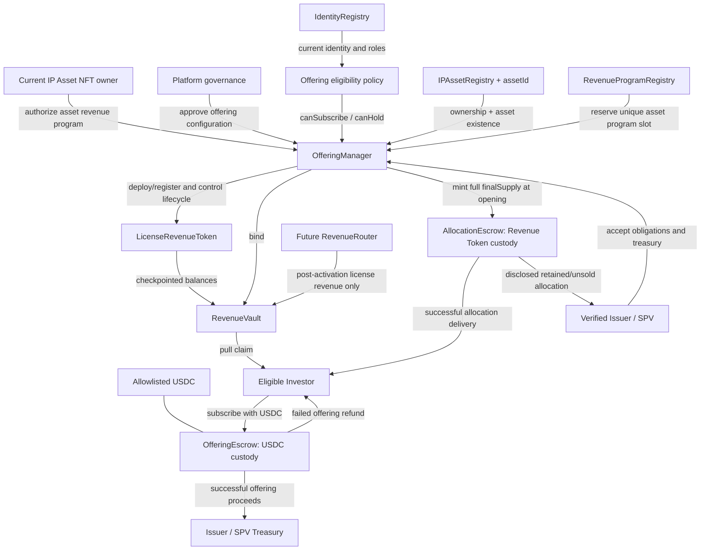
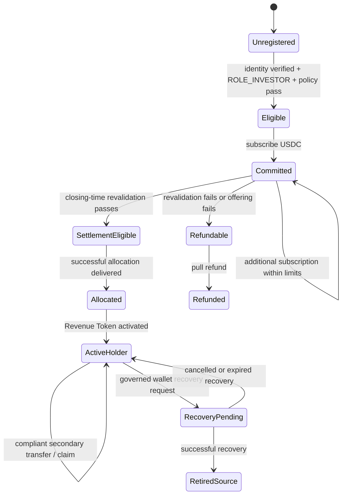

# Phase 3.2-0 Offering Architecture Design Freeze

**Status:** Design freeze  
**Date:** 2026-07-21  
**Scope:** Primary offering, investor subscription, USDC custody, allocation, refund, and revenue-program activation  
**Implementation:** No Solidity changes in Phase 3.2-0

## 1. Purpose and boundary

Phase 3.2 introduces the primary issuance layer between a verified IP asset and the Phase 3.1 Revenue Token/Vault pair.

```text
verified IP asset
    -> authorized revenue program
    -> compliant primary offering
    -> funded issuer/SPV
    -> activated Revenue Token
    -> future license revenue deposited into RevenueVault
```

The offering sells Revenue Token units for USDC. It does not sell the IP Asset NFT, grant an IP license, promise redemption, or place investment proceeds into the RevenueVault.

Two cash flows must remain permanently distinct:

```text
primary offering proceeds:
Investor -> OfferingEscrow -> Issuer/SPV Treasury or refund

future operating revenue:
License settlement -> RevenueRouter -> RevenueVault -> Token holder claim
```

Commingling these flows would make offering principal appear to be distributable license revenue and is forbidden.

## 2. Decisions at a glance

| Topic | Frozen Phase 3.2-0 decision |
|---|---|
| Issuance authorization | Current IP NFT owner authorizes the program; a verified issuer/SPV is the legal obligor; the platform operates the OfferingManager. |
| Offering scope | One offering funds one asset-level revenue program and one Token/Vault pair. |
| Subscription asset | One immutable, allowlisted USDC contract per offering. |
| Mint timing | Option B: mint the complete fixed supply to a controlled allocation escrow when funding opens. |
| Fund custody | Investor USDC remains segregated in OfferingEscrow until success or failure is finalized. |
| Distribution | Tokens remain locked during funding and are delivered from allocation escrow only after success becomes irreversible. |
| Success | Eligible net commitments meet the soft cap before the deadline and settlement checks pass. |
| Failure | Soft cap missed, authorized pre-settlement cancellation, or mandatory compliance failure; investors receive pull refunds. |
| Revenue activation | RevenueVault deposits remain disabled until allocations are complete and the Token is activated. |
| Investor rights | Revenue participation and compliant secondary transfer only; no governance or redemption right. |
| Global uniqueness | At most one live offering and one activated revenue program per `(IPAssetRegistry, assetId)`. |

## 3. Complete offering architecture



`OfferingEscrow` and `AllocationEscrow` are logical responsibilities. They may be separate contracts or isolated modules, but their authority and accounting cannot be merged with RevenueVault.

## 4. OfferingManager responsibility

`OfferingManager` is the state machine and orchestration layer for one or more registered offerings. It is not the issuer and must not become the beneficial owner of offering proceeds.

It is responsible for:

- validating the IP asset exists and the authorizer currently owns its NFT;
- requiring the authorizer's active `ROLE_ASSET_OWNER` identity;
- recording the verified issuer/SPV, treasury, offering terms hash, jurisdiction, and disclosure references;
- reserving the asset in `RevenueProgramRegistry` before Token/Vault creation;
- deploying or registering the exact Token, Vault, OfferingEscrow, eligibility policy, and USDC addresses;
- configuring immutable caps, price, supply allocation, opening time, closing time, and settlement deadline;
- opening and closing subscriptions;
- recording unique investor commitments and aggregate eligible USDC;
- coordinating full-supply mint into AllocationEscrow;
- determining success or failure without operator discretion over the frozen thresholds;
- enabling token allocation delivery only after success is locked;
- activating the Revenue Token only after complete allocation reconciliation;
- releasing USDC proceeds or enabling refunds according to the terminal outcome; and
- emitting enough information to reconstruct every lifecycle transition and fund movement.

It must not:

- modify price, caps, final supply, settlement asset, issuer, treasury, revenue share, or deadlines after the first subscription;
- send offering proceeds to RevenueVault;
- deposit synthetic revenue;
- use subscriber funds before success;
- execute wallet recovery;
- bypass investor eligibility; or
- create a second active revenue program for the same asset.

### 4.1 Authority separation

| Actor | Responsibility | Must not control alone |
|---|---|---|
| Current IP NFT owner | Authorizes encumbrance of the asset's defined revenue stream | Platform approval, identity verification, custody release |
| Issuer/SPV | Accepts legal payment and revenue-remittance obligations | Eligibility decisions, offering success override |
| Platform governance | Approves supported configuration and administers system contracts | Beneficial ownership of proceeds or unilateral asset-owner consent |
| Identity verifier | Verifies participants and roles | Offering approval, custody release, token mint |
| Offering operator | Executes deterministic lifecycle calls | Change frozen terms or redirect funds |
| Investor | Subscribes and receives/refunds its own position | Administrative offering transitions |

The preferred production holders of administrative powers are separated multisigs or timelocked governance modules, not a shared EOA.

## 5. Investor lifecycle



### 5.1 Subscription-time checks

Before accepting USDC, the system requires:

1. offering state is `Funding` and current time is within the subscription window;
2. subscriber identity is currently verified;
3. subscriber has active `ROLE_INVESTOR`;
4. subscriber and designated receiving wallet pass offering-specific eligibility;
5. jurisdiction, sanctions, accreditation, concentration, and per-wallet limits pass;
6. subscription does not exceed remaining offered units or hard cap;
7. the USDC address exactly matches the offering configuration;
8. actual USDC received equals the declared amount; and
9. the subscription ID has not been used.

The destination wallet consents to receiving the regulated Token position. If subscriber and destination differ, the relationship and consent are committed to the subscription record.

### 5.2 Settlement-time revalidation

Identity and eligibility are rechecked before a commitment is included in successful settlement. A commitment that no longer qualifies is excluded from eligible committed capital and becomes refundable. The success threshold is evaluated on eligible net commitments, not stale gross deposits.

An invalid investor cannot block every other investor indefinitely. A frozen remediation window may allow a consented eligible replacement wallet before final settlement; changing beneficial owner requires a new subscription or an explicitly approved assignment process.

### 5.3 After allocation

Once Token allocation is delivered and the program activates:

- the investor participates only in subsequently accounted RevenueVault deposits;
- secondary transfers use the Token's compliance and checkpoint rules;
- there is no protocol redemption at par or guaranteed exit;
- accrued revenue follows the transfer checkpoint rules; and
- lost-wallet replacement uses RecoveryManager rather than an OfferingManager balance edit.

## 6. USDC settlement flow

### 6.1 Subscription

```text
Investor
  -> approve / permit exact allowlisted USDC
  -> OfferingEscrow receives USDC
  -> OfferingManager records subscriptionId and token allocation
```

For subscription `i`:

```text
tokenUnits[i] = floor(usdcAmount[i] * tokenUnitsPerUSDC)
```

The price formula, rounding direction, minimum subscription, and treatment of unusable dust are frozen in offering terms. The baseline rounds Token allocation down and rejects or refunds USDC that cannot purchase the minimum Token unit; rounding must never mint or allocate above `offeredSupply`.

### 6.2 Successful settlement

After eligible commitments satisfy the success rule:

```text
OfferingEscrow balance
  = issuer proceeds
  + disclosed protocol fee
  + refundable excluded commitments
```

Only the issuer proceeds and disclosed fee are releasable. Excluded commitments remain reserved for their owners. Release destinations and fee rates are immutable after funding opens.

Fund release occurs only after allocation reconciliation and Token activation succeed. The final transition must atomically:

1. verify all successful subscriptions are allocated;
2. reconcile investor, issuer-retained, and unsold Token units to `finalSupply`;
3. activate the Token and revenue program;
4. mark proceeds releasable; and
5. prevent entry into any refund-only failure path.

Actual USDC payout may use pull withdrawals by the fixed treasury and fee recipient. This avoids arbitrary external calls inside a large settlement loop.

### 6.3 Failed settlement

If the offering fails, no USDC is released to the issuer and no Revenue Token becomes active. Each investor may pull exactly its refundable balance from OfferingEscrow.

### 6.4 Settlement references

Every business event is uniquely identified. At minimum:

```text
offeringId
subscriptionId
investor identity commitment
receiving wallet
USDC amount
Token units
termsHash
paymentReferenceHash
```

`subscriptionId` is single-use and domain-separated by chain, OfferingManager, and offering. `paymentReferenceHash` may commit to an invoice, bank/processor reference, or signed subscription document without placing plaintext personal information on-chain.

Future license-revenue deposits require a different settlement reference containing the license agreement and revenue program identifiers. An offering subscription ID can never be accepted as a RevenueVault deposit reference.

## 7. Token mint timing

### 7.1 Selected model: Option B

The complete immutable `finalSupply` is minted once to AllocationEscrow when the offering enters `Funding`.

```text
Created
  -> Token/Vault/escrows bound
  -> begin Token Minting
  -> mint finalSupply to AllocationEscrow
  -> open Funding
```

Reasons for selecting Option B:

- supply and dilution are fixed before investor money is accepted;
- the offering never depends on post-success mint authority;
- Token units are visibly reserved for the disclosed program;
- investor allocation cannot exceed escrowed supply; and
- failure cannot create a partially active holder set.

AllocationEscrow is a registered system custodian and must be explicitly accepted by the offering eligibility policy. That exception authorizes custody only; it does not give the escrow an investor identity, a discretionary transfer right, or beneficial ownership of the allocation.

### 7.2 Allocation reconciliation

The fixed supply is partitioned as:

```text
finalSupply
  = investor allocations
  + disclosed issuer-retained allocation
  + disclosed unsold allocation destination
```

Unsold units are not burned because `finalSupply` is immutable and arbitrary burn changes future revenue fractions. The offering terms must disclose whether unsold units go to the issuer/SPV reserve or another eligible locked reserve. They cannot be silently reassigned after subscriptions begin.

### 7.3 Distribution before activation

The current Token permits minting before activation but not ordinary pre-activation transfers. Phase 3.2 implementation therefore needs a narrowly scoped allocation-delivery path or lifecycle state that:

- is callable only by the registered OfferingManager/AllocationEscrow;
- transfers only recorded successful allocations;
- does not enable investor-to-investor transfers;
- performs eligibility checks immediately before delivery;
- cannot change total supply; and
- is permanently disabled at activation.

Successful settlement becomes irreversible before allocation delivery starts. Once any successful investor allocation has been delivered, the offering cannot switch to failure/refunds because that would require confiscating or burning distributed Tokens.

Allocation may be delivered in bounded batches, by investor pull, or by permissionless delivery for a recorded investor. USDC remains escrowed until every successful allocation and residual supply destination is reconciled.

### 7.4 Failed offering tokens

On failure, all Revenue Tokens remain in AllocationEscrow, the Token never activates, and the RevenueVault never accepts deposits. The failed program is permanently marked non-activatable. A later offering may use a new Token/Vault pair only after RevenueProgramRegistry releases the live-offering reservation and permanently tombstones the failed pair.

## 8. Fund custody model

The baseline uses segregated escrow custody:

| Asset | Custodian | During funding | On success | On failure |
|---|---|---|---|---|
| Investor USDC | OfferingEscrow | Locked and attributed per investor | Claimable by fixed issuer treasury/fee recipient after activation | Pull-refundable to original funder |
| Revenue Token supply | AllocationEscrow | Locked; no ordinary transfer | Delivered to successful investors and disclosed reserve destinations | Permanently locked in failed, non-activatable program |
| Future license revenue | RevenueVault | Deposits disabled | Accepted only after program activation | Never accepted |

Custody invariants:

```text
OfferingEscrow USDC balance
  >= outstanding investor refunds
   + unreleased issuer proceeds
   + unreleased protocol fees

total USDC released + total USDC refunded
  <= total USDC received

AllocationEscrow balance + delivered allocation
  == finalSupply before activation reconciliation completes
```

OfferingManager records accounting but cannot expose a generic withdrawal function. OfferingEscrow permits only outcome-specific pull payments to immutable beneficiaries.

RevenueVault is never the custodian of subscription principal. Depositing offering proceeds into RevenueVault is a protocol accounting violation even if Token holders and investors happen to be the same accounts.

## 9. Offering states and transitions

```mermaid
stateDiagram-v2
    [*] --> Draft
    Draft --> Funding: validate + reserve asset + bind program + escrow full supply
    Draft --> Cancelled: cancel before opening
    Funding --> Settling: close with eligible commitments >= soft cap
    Funding --> Refunding: deadline below soft cap
    Funding --> Refunding: authorized cancellation
    Settling --> Active: allocations reconciled + Token/program activated
    Refunding --> Failed: failure recorded; refunds remain claimable
    Active --> [*]
    Cancelled --> [*]
    Failed --> [*]
```



### 9.1 Draft

Terms may be configured but no investor funds are accepted. Asset owner, issuer/SPV, platform approval, program uniqueness, contract bindings, and disclosure commitments must be complete before opening.

### 9.2 Funding

USDC subscriptions are accepted and held in escrow. Frozen economic terms cannot change. Reaching the hard cap may close funding early; otherwise funding closes at the deadline.

### 9.3 Settling

Success has become irreversible. The system revalidates commitments, delivers allocations, reconciles the full Token supply, and prepares fund release. RevenueVault deposits and ordinary Token transfers remain disabled.

A technical delay in batch delivery does not convert a successful offering into failure. Permissionless delivery and a governed liveness fallback must allow settlement to complete without changing allocations or destinations.

### 9.4 Active

All supply is reconciled, the Token is activated, primary proceeds become withdrawable by their fixed beneficiaries, and the revenue program may accept future eligible license revenue. The offering cannot reopen.

### 9.5 Refunding, Failed, and Cancelled

`Refunding` enables investor pull refunds. `Failed` records a terminal unsuccessful offering while unclaimed refunds remain liabilities indefinitely or for a legally defined claims process. `Cancelled` is used only before funding opens; cancellation after any subscription enters `Refunding`.

Invalid transitions revert. No admin may rewrite a terminal result.

## 10. Offering success and failure rules

### 10.1 Success

An offering succeeds only if:

- current time is at or after its permitted close, or the hard cap is reached;
- eligible net committed USDC is at least the immutable soft cap;
- total allocation does not exceed offered supply;
- issuer, treasury, Token, Vault, escrows, eligibility policy, and settlement asset still match the registered program;
- no program-level legal hold blocks settlement;
- every included investor passes settlement-time eligibility; and
- escrow balances fully cover proceeds, fees, and excluded-investor refunds.

The operator reports no subjective success flag. The outcome is derived from frozen terms and current validated state.

### 10.2 Failure

Failure occurs when:

- the deadline passes with eligible commitments below the soft cap;
- a mandatory pre-settlement legal or compliance condition fails;
- the asset authorization is invalidated before success becomes irreversible; or
- an authorized cancellation occurs while still in `Funding` and the offering terms permit it.

Contract-call failure is not automatically economic offering failure. Temporary technical faults must leave the state retryable unless a frozen deadline or legal rule produces a terminal outcome.

## 11. Refund model

Refunds are pull payments from OfferingEscrow to the original funder or a legally authorized replacement payout address.

```text
refundable[investor]
  = accepted USDC
  - previously refunded USDC
  - successfully settled USDC
```

Rules:

- refunds are funded before becoming claimable;
- setting an offering to `Failed` cannot reduce total refund liability;
- a refund is cleared before the external USDC transfer;
- failed transfer reverts the accounting change;
- each USDC unit is released, refunded, or remains reserved exactly once;
- no administrator may redirect an investor refund to the issuer;
- refund claims do not loop over investors; and
- refund rights do not create Token redemption rights after successful activation.

The baseline treats subscriptions as binding during `Funding`; investors do not have a discretionary withdrawal right unless the offering terms and applicable law explicitly add a cooling-off window. Failure, cancellation, or settlement-time exclusion always creates a refund right.

## 12. RevenueToken activation relationship

Token activation is the boundary between primary allocation and live revenue participation.

Required order:

```text
1. offering success becomes irreversible
2. all included subscriptions are revalidated
3. investor and reserve allocations are delivered
4. delivered + escrow residual reconciliation equals finalSupply
5. Token activates exactly once
6. RevenueProgramRegistry marks the program Active
7. OfferingEscrow proceeds become withdrawable
8. RevenueVault deposit gate opens
```

Activation invariants:

```text
Token.totalSupply == Token.finalSupply
allocation reconciliation == finalSupply
outstanding successful allocation == 0
Token, Vault, eligibility policy, USDC, issuer, and assetId match registry
offering state == Settling
```

No RevenueVault deposit is permitted in `Draft`, `Funding`, `Settling`, `Refunding`, `Failed`, or `Cancelled`. The Vault must validate active program status rather than trusting depositor procedure alone.

After activation, OfferingManager loses mint and primary-allocation authority. It cannot pause claims, edit holder balances, execute recovery, or change the economic denominator.

## 13. Identity and eligibility requirements

### 13.1 Asset owner and issuer

Program creation requires:

- current `IPAssetRegistry.ownerOf(assetId)` ownership;
- active owner identity with `ROLE_ASSET_OWNER`;
- verified issuer/SPV identity and jurisdictional approval; and
- explicit asset-owner authorization bound to the program terms and issuer.

The asset owner and issuer may be the same legal entity only if offering policy permits it. Platform operation never substitutes for issuer liability.

### 13.2 Investor

At subscription and settlement, the investor must have:

- current verified identity;
- active `ROLE_INVESTOR`;
- offering-specific jurisdiction/accreditation eligibility;
- no sanctions or legal-hold restriction represented by the policy;
- capacity under per-investor and concentration limits; and
- a consented receiving wallet eligible to hold the Token.

IdentityRegistry is the canonical identity-status source. A production eligibility adapter combines Registry state with offering-specific rules. A mock or manually administered eligibility mapping is not acceptable for production activation.

### 13.3 Post-activation changes

If identity becomes invalid after allocation:

- ordinary Token transfers follow the frozen compliance policy;
- earned revenue is preserved and handled according to the Phase 3.2 claim-policy decision;
- the OfferingManager cannot confiscate or rewrite the position; and
- wallet replacement uses RecoveryManager with execution-time identity and eligibility validation.

Source isolation and permanent retirement belong to the identity/recovery policy shared by Token and Vault, not to OfferingManager-specific balance powers.

### 13.4 Privacy

On-chain state and events store hashes, identifiers, status, roles, expiry, jurisdiction codes where required, and policy outcomes. Names, government identifiers, subscription documents, bank records, and evidence remain off-chain.

## 14. One asset, one offering constraint

`RevenueProgramRegistry` owns global uniqueness for:

```text
assetKey = keccak256(chainId, IPAssetRegistry, assetId)
```

For each `assetKey`:

- at most one live offering may be in `Funding` or `Settling`;
- at most one revenue program may ever be `Active` unless a separately designed wind-down and migration completes;
- Token, Vault, OfferingManager, issuer, eligibility policy, USDC, and terms hash are registered together;
- an asset reservation is created before accepting subscriptions;
- a failed/cancelled attempt is tombstoned and cannot later activate;
- failure may release the live-offering slot for a new registered attempt; and
- activation permanently consumes the active-program slot.

Transferring the IP Asset NFT after program authorization does not silently terminate the program, transfer issuer obligations, redirect the treasury, or create another offering right. The legal agreement must define successor obligations, while the registry prevents duplicate on-chain revenue claims.

No Token constructor, asset owner, or platform EOA can enforce global uniqueness independently. All production deployments must originate from or be registered by the canonical RevenueProgramRegistry.

## 15. Economic and security invariants

### 15.1 Offering conservation

```text
totalUSDCReceived
  == totalUSDCRefunded
   + totalUSDCReleasedToIssuer
   + totalFeesReleased
   + currentOfferingEscrowBalance

totalTokenDelivered
  + currentAllocationEscrowBalance
  == finalSupply
```

### 15.2 No cross-ledger contamination

```text
offering principal deposited into RevenueVault == 0
RevenueVault license revenue used for investor refund == 0
```

### 15.3 Outcome exclusivity

```text
Active => issuer proceeds path enabled and failure refund path disabled
Failed => investor refund path enabled and issuer proceeds path disabled
```

Excluded commitments may remain refundable after an otherwise successful offering; their USDC is never counted as issuer proceeds.

### 15.4 Supply and allocation

- no subscription can allocate more than its paid and accepted USDC permits;
- aggregate investor allocation cannot exceed `offeredSupply`;
- all final supply destinations are disclosed before funding;
- allocation delivery cannot change total supply;
- activation requires exact full-supply reconciliation; and
- a failed Token/Vault pair can never later activate.

### 15.5 Identity and replay

- subscription and settlement both require current eligibility;
- each subscription ID is single-use;
- a payment cannot be counted in two offerings;
- terms or destination changes require a newly consented record;
- refunds and allocations cannot be claimed twice; and
- no plaintext PII appears in state or events.

## 16. Known limitations deferred to implementation design

This freeze selects architecture but does not yet define Solidity ABIs. Before implementation, the following require exact interface specifications:

- RevenueProgramRegistry deployment and upgrade model;
- the pre-activation allocation-delivery extension to LicenseRevenueToken;
- OfferingEscrow segregation: one escrow per offering versus a formally isolated multi-offering ledger;
- USDC `permit` support and supported chain-specific contract addresses;
- permissionless allocation-delivery and settlement liveness mechanism;
- legal-hold and asset-authorization invalidation source;
- post-allocation claim behavior for identities that become ineligible;
- issuer fee and tax withholding order;
- treatment of permanently unclaimed refunds under applicable law; and
- migration/wind-down design for an already active revenue program.

## 17. Phase 3.2 implementation gates

Solidity implementation should not begin until the following artifacts are frozen:

1. OfferingManager state machine and transition authority matrix;
2. RevenueProgramRegistry uniqueness and tombstone rules;
3. OfferingEscrow liability model and pull-payment interfaces;
4. exact Token pre-activation distribution mechanism;
5. production IdentityRegistry-backed eligibility policy;
6. USDC pricing, decimals, rounding, caps, fees, and settlement references;
7. success-to-settlement irreversibility boundary;
8. failed-program non-activation enforcement;
9. RevenueVault active-program deposit gate; and
10. invariant-test model for random subscriptions, exclusions, allocations, refunds, releases, and activation attempts.

Required stateful properties include USDC conservation, Token allocation conservation, outcome exclusivity, one-program-per-asset uniqueness, no double allocation/refund, no pre-activation revenue deposit, and atomic failure behavior.

## 18. Non-goals

Phase 3.2-0 does not design or implement:

- a secondary-market AMM or order book;
- protocol redemption or buyback;
- investor governance;
- fiat payment rails or automatic currency conversion;
- cross-chain issuance;
- public token-sale marketing rules;
- legal classification or offering-document language;
- LicenseEscrow-to-RevenueVault routing implementation; or
- Solidity contracts.

Those items require separate design freezes and cannot be inferred from a successful primary offering.
