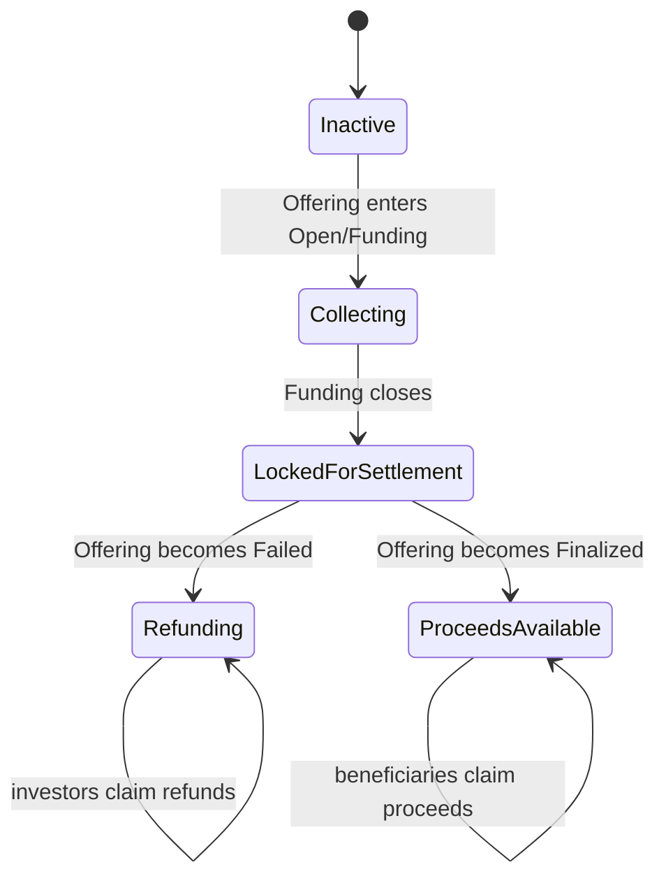

# Phase 3.2-1C OfferingEscrow Design Freeze

**Status:** Design freeze  
**Date:** 2026-07-21  
**Scope:** Primary-offering USDC custody, contribution accounting, refunds, and successful proceeds withdrawal  
**Implementation:** No Solidity changes in Phase 3.2-1C Design Freeze

## 1. Purpose and boundary

`OfferingEscrow` is the funded USDC liability boundary for one primary Revenue Token offering.

```text
Investor USDC
    -> OfferingEscrow
       -> Failed: investor pull refund
       -> Finalized: issuer treasury and fee recipient pull proceeds
```

It keeps primary investment principal separate from future operating revenue:

```text
OfferingEscrow = subscription principal and offering refunds
RevenueVault   = post-activation license revenue and holder claims
```

OfferingEscrow never:

- holds or distributes Revenue Tokens;
- declares Offering success or failure;
- calculates investor eligibility;
- chooses FCFS order or Token fill;
- deposits offering principal into RevenueVault;
- pays Revenue Token holder claims;
- changes Token supply or activation state;
- acts as issuer treasury; or
- exposes a generic owner withdrawal.

## 2. Decisions at a glance

| Topic | Frozen v1 decision |
|---|---|
| Custody scope | One Escrow serves one immutable `offeringId` and one USDC contract |
| Funding entry | Only OfferingManager may request collection for an exact committed subscription |
| Asset | Exact allowlisted six-decimal USDC address; no native ETH or alternate ERC-20 |
| Contribution record | One immutable funded record per `subscriptionId` |
| Oversubscription | Escrow pulls only USDC for the FCFS `filled` Token amount; excess is never deposited |
| Failure | Every committed contribution becomes pull-refundable to its original contributor |
| Success | Funds remain locked in `Successful`; withdrawal opens only after `Finalized` |
| Proceeds | Fixed issuer treasury and protocol fee recipient withdraw their own balances |
| Payment model | Pull refunds and pull proceeds; no investor or beneficiary loops |
| Direct transfers | Unsolicited USDC is unaccounted excess and creates no subscription or liability |
| Administration | Immutable bindings; no arbitrary sweep of accounted funds |

## 3. USDC custody responsibility

OfferingEscrow preserves enough USDC to satisfy every outstanding offering liability.

Its immutable program binding includes:

```text
offeringManager
offeringId
revenueProgramRegistry
usdc
issuerTreasury
feeRecipient
feeRate or fixed fee formula
termsHash
```

The Escrow validates these values against RevenueProgramRegistry and OfferingManager. None may be replaced after the offering opens.

### 3.1 Custody phases



These phases may be derived from OfferingManager state rather than duplicated. OfferingEscrow must never maintain an outcome that disagrees with the canonical Manager.

### 3.2 Liability classes

Every accounted USDC unit belongs to exactly one class:

```text
CommittedContribution
RefundLiability
IssuerProceedsLiability
ProtocolFeeLiability
AlreadyPaid
```

Reclassification occurs only through a valid Manager outcome transition and never changes total accounted USDC.

## 4. Deposit flow

### 4.1 Atomic subscription collection

The investor approves OfferingEscrow to spend the exact allowlisted USDC. OfferingManager then orchestrates collection:

```mermaid
sequenceDiagram
    participant I as Investor
    participant M as OfferingManager
    participant E as OfferingEscrow
    participant U as USDC
    participant A as AllocationEscrow

    I->>U: approve(Escrow, maxUSDC)
    I->>M: subscribe(requestedUnits, minFill, maxUSDC, destination, references)
    M->>M: validate identity, time, capacity; compute filled and usdcCost
    M->>E: collectContribution(exact subscription tuple)
    E->>U: transferFrom(investor, Escrow, usdcCost)
    E->>E: verify exact balance delta; record funded contribution
    M->>M: record commitment and aggregate totals
    M->>A: registerAllocation(exact filled units)
    M-->>I: SubscriptionAccepted
```

All calls occur in one transaction. Failure in USDC receipt, Manager accounting, or AllocationEscrow registration reverts the USDC transfer and every record.

### 4.2 Deposit preconditions

`collectContribution` requires:

- caller is the immutable OfferingManager;
- Manager reports the offering is `Open` in its Funding subphase;
- current time is in `[opensAt, closesAt)`;
- `subscriptionId` is nonzero and unused;
- contributor and designated Token destination match the Manager commitment;
- filled Token amount is nonzero and allocation-lot aligned;
- USDC amount equals the Manager's exact price quote for filled units;
- USDC amount does not exceed investor `maxUSDC`;
- resulting Manager commitment does not exceed `finalSupply` or `targetUSDC`;
- payment and terms references match the subscription; and
- sufficient allowance and balance exist.

Escrow does not independently decide investor eligibility or capacity, but it verifies the Manager exposes the same authorized tuple before pulling funds.

### 4.3 Exact receipt

For expected amount `x`:

```text
balanceBefore = USDC.balanceOf(OfferingEscrow)
transferFrom(contributor, OfferingEscrow, x)
balanceAfter = USDC.balanceOf(OfferingEscrow)

require balanceAfter - balanceBefore == x
```

Fee-on-transfer, rebasing, callback-dependent, or otherwise incompatible assets fail closed. The configured address, not symbol, identifies USDC.

### 4.4 Permit boundary

EIP-2612 or Permit2 may reduce the approval transaction only if supported by a separately reviewed adapter. Permit data never changes price, fill, contributor, destination, or settlement reference. Baseline correctness does not depend on permit support.

## 5. Investor contribution accounting

### 5.1 Contribution record

Conceptually:

```text
Contribution {
    subscriptionId
    contributor
    investorCommitment
    tokenDestination
    filledTokenAmount
    usdcAmount
    sequence
    paymentReferenceHash
    termsHash
    status: Funded | Refunded | Settled
}
```

On-chain identity uses a commitment or protocol identifier. Plaintext names, documents, bank references, or government identifiers are never stored.

### 5.2 Global accounting

At minimum, Escrow records:

```text
totalContributed
totalRefunded
totalIssuerProceeds
totalIssuerWithdrawn
totalProtocolFees
totalFeesWithdrawn
contributionHash[subscriptionId]
contributionStatus[subscriptionId]
refundCredit[contributor or subscriptionId]
```

OfferingManager separately records `committedSupply`, `committedUSDC`, reconciled `soldSupply`, and `acceptedUSDC`. Cross-contract totals must agree at every integration boundary.

### 5.3 Immutability and replay

After funding:

- contributor, destination, Token amount, USDC amount, sequence, and references cannot change;
- `subscriptionId` can never fund twice;
- refund or successful settlement changes status but not historical amount;
- a failed transfer creates no contribution record; and
- changing destination or economic terms requires a new valid subscription before funding closes.

### 5.4 Contribution versus beneficial Token allocation

OfferingEscrow proves USDC funding; AllocationEscrow proves Token custody and delivery. Neither record alone completes a subscription.

```text
valid committed subscription
  = funded OfferingEscrow contribution
  + matching OfferingManager commitment
  + matching AllocationEscrow allocation record
```

Any mismatch reverts the originating transaction or blocks settlement.

## 6. FCFS payment settlement

OfferingManager determines the FCFS fill:

```text
remaining = finalSupply - committedSupply
filled = min(requestedTokenAmount, remaining)
```

After `minFill` and allocation-lot checks pass, Manager calculates exact USDC:

```text
usdcCost
  = filled * pricePerWholeTokenUSDC / 10^18
```

The allocation lot makes this division exact for six-decimal USDC. OfferingEscrow accepts only the quoted `usdcCost`; it does not round, recalculate price, or infer Token quantity from an arbitrary deposit.

FCFS settlement properties:

- transaction ordering determines priority;
- a reverted payment consumes no priority, allocation sequence, or supply;
- only completed USDC custody counts toward commitment totals;
- Manager and both Escrows record the same `subscriptionId` and sequence;
- no off-chain payment is considered funded without the on-chain USDC balance increase; and
- `totalContributed` cannot exceed `targetUSDC`.

The investor supplies `maxUSDC`; if quoted cost exceeds it, the transaction reverts without pulling funds.

## 7. Oversubscription handling

Version 1 never intentionally holds oversubscribed USDC.

For requested amount greater than remaining Token supply:

```text
candidateFill = remaining
```

- if `candidateFill >= minFill`, only `candidateFill` is allocated and only its exact USDC cost is pulled;
- if `candidateFill < minFill`, the entire transaction reverts;
- if remaining is zero, the offering is sold out and the transaction reverts;
- the unfilled request has no queue position or later claim; and
- no pro-rata redistribution occurs.

### 7.1 No deposit-then-refund pattern

Escrow must not pull USDC for the full requested amount and then push excess back. Pulling only accepted cost:

- avoids temporary excess custody;
- removes a refund callback from the subscription path;
- makes contribution and allocation totals exact;
- reduces reentrancy surface; and
- prevents a failed excess refund from blocking an otherwise valid partial fill.

### 7.2 Unsolicited transfers

A direct USDC transfer that bypasses `collectContribution`:

- does not create a subscription;
- does not increase `totalContributed`;
- does not reserve Token;
- does not help reach success; and
- does not create an automatic refund liability.

It is accounted as unsolicited excess:

```text
excessUSDC
  = actualUSDCBalance - accountedEscrowBalance
```

A future delayed excess-recovery function may return only proven excess without reducing any refund, proceeds, or fee liability. It is excluded from v1 unless separately audited.

## 8. Failed refund flow

### 8.1 Refund entitlement

When OfferingManager reaches terminal `Failed`, every funded v1 contribution becomes refundable because v1 requires a complete eligible sell-out for success.

For subscription `s`:

```text
refundable[s]
  = contributionUSDC[s] - refundedUSDC[s]
```

Failure reclassifies contribution liability; it does not move USDC or loop over investors.

### 8.2 Pull refund

The original contributor calls `claimRefund(subscriptionId)`.

Required checks:

- canonical Manager state is `Failed`;
- contribution exists and is still `Funded`;
- caller is the original contributor;
- subscription has not been refunded or settled; and
- Escrow remains solvent for all liabilities.

CEI order:

```text
read refund amount
  -> mark contribution Refunded
  -> increment totalRefunded
  -> clear refund credit
  -> transfer exact USDC to original contributor
  -> verify solvency
  -> emit RefundClaimed
```

If USDC transfer fails, every accounting change reverts. A second claim fails.

### 8.3 Refund destination

Baseline refunds return only to the original USDC contributor. OfferingManager, issuer, platform, Token destination, and arbitrary caller cannot redirect them.

A lost contributor wallet or legally mandated payout change requires a separately designed, consented refund-recovery process. Revenue Token RecoveryManager cannot redirect USDC refunds.

### 8.4 Refund duration

Unclaimed refunds remain fully reserved. Marking the offering failed or tombstoning its Token does not expire refund liability. Any legally required abandoned-property process must be separately designed and cannot become an admin sweep.

## 9. Successful issuer release

### 9.1 Funds remain locked in `Successful`

`Successful` permits AllocationEscrow Token delivery but does not permit issuer or fee withdrawal. USDC remains locked until:

- all allocations are delivered;
- Token activates;
- RevenueProgramRegistry marks the program active;
- OfferingManager reaches `Finalized`; and
- Escrow verifies its immutable bindings and exact target funding.

This prevents issuer payment when investor Token delivery or activation remains incomplete.

### 9.2 Proceeds calculation

For target USDC `T` and frozen fee formula:

```text
protocolFee = fee(T)
issuerProceeds = T - protocolFee

issuerProceeds + protocolFee == T
```

The fee recipient, fee rate, rounding direction, and maximum fee are frozen before opening. The baseline computes the fee once at finalization with explicit full-precision arithmetic. There are no undisclosed deductions.

### 9.3 Pull proceeds

After `Finalized`:

- only immutable `issuerTreasury` may withdraw `issuerProceeds`;
- only immutable `feeRecipient` may withdraw `protocolFee`;
- each beneficiary may withdraw at most its remaining credit;
- one beneficiary's failed transfer cannot block the other; and
- OfferingManager does not receive or forward either payment.

The Escrow may expose separate functions such as `claimIssuerProceeds()` and `claimProtocolFee()`. Both follow CEI, are non-reentrant, and recheck solvency.

### 9.4 Outcome exclusivity

For v1:

```text
Failed
  => totalIssuerProceeds == 0
  => totalProtocolFees == 0
  => every contribution refundable

Finalized
  => totalIssuerProceeds + totalProtocolFees == totalContributed == targetUSDC
  => no ordinary failure refund
```

No contribution may fund both an issuer withdrawal and an investor refund.

## 10. Pull payment model

OfferingEscrow never loops over contributors or pushes funds during an outcome transition.

| Liability | Claimant | Enabling state | Destination |
|---|---|---|---|
| Investor refund | Original contributor | `Failed` | Original contributor |
| Issuer proceeds | Immutable issuer treasury | `Finalized` | Issuer treasury |
| Protocol fee | Immutable fee recipient | `Finalized` | Fee recipient |

Pull payments provide:

- bounded gas independent of investor count;
- failure isolation between recipients;
- straightforward no-double-payment accounting;
- CEI-compatible external transfers; and
- persistent liabilities for recipients that claim later.

Claim functions cannot accept arbitrary destination parameters in v1. A beneficiary contract must be able to receive the configured USDC transfer or use a separately governed address-replacement process frozen before opening.

## 11. Settlement reference

### 11.1 Subscription identity

Each contribution is bound to:

```text
offeringId
subscriptionId
sequence
chainId
OfferingManager
OfferingEscrow
USDC
contributor
investorCommitment
Token destination
filled Token amount
USDC amount
price
termsHash
paymentReferenceHash
```

Conceptually:

```text
subscriptionId = keccak256(
  chainId,
  OfferingManager,
  offeringId,
  contributor,
  contributorNonce,
  destination,
  filledTokenAmount,
  termsHash
)
```

The exact hash schema is domain-separated and frozen before implementation. A subscription ID is single-use across Manager, OfferingEscrow, and AllocationEscrow.

### 11.2 Payment reference

`paymentReferenceHash` commits to the off-chain subscription agreement, invoice, processor reference, or evidence bundle. It:

- must be nonzero;
- cannot be reused within the offering unless policy explicitly identifies installments;
- does not replace actual USDC receipt;
- contains no plaintext PII; and
- is emitted with the subscription ID for audit correlation.

### 11.3 Separation from revenue settlement

Offering settlement references and future license-revenue references occupy separate domains.

```text
Offering subscription reference
  != License agreement settlement reference
  != RevenueVault deposit reference
```

OfferingEscrow never forwards its subscription ID to RevenueVault as proof of operating revenue.

## 12. USDC invariants

### 12.1 Conservation

For accounted USDC:

```text
totalContributed
  == totalRefunded
   + totalIssuerWithdrawn
   + totalFeesWithdrawn
   + accountedEscrowBalance
```

Unsolicited excess is excluded from both sides and tracked separately.

### 12.2 Solvency

```text
accountedEscrowBalance
  = outstandingCommittedContribution
  + outstandingRefundLiability
  + outstandingIssuerProceeds
  + outstandingProtocolFees

actualUSDCBalance >= accountedEscrowBalance
```

Equality holds without unsolicited transfers. Every deposit and payment rechecks the balance relationship.

### 12.3 Contribution bounds

```text
0 <= totalContributed <= targetUSDC
sum(contributionUSDC) == totalContributed

Open or Successful
  => totalRefunded == 0
  => totalIssuerWithdrawn == 0
  => totalFeesWithdrawn == 0

Finalized
  => totalContributed == targetUSDC
```

### 12.4 No double settlement

- one `subscriptionId` funds at most once;
- one contribution is refunded or settled, never both;
- refunded amount never exceeds contribution amount;
- issuer withdrawn never exceeds issuer proceeds;
- fees withdrawn never exceed protocol fee;
- failed transfer consumes no credit; and
- direct transfer creates no credit.

### 12.5 Cross-contract equality

During funding:

```text
OfferingEscrow.totalContributed
  == OfferingManager.committedUSDC

sum(funded contribution Token units)
  == OfferingManager.committedSupply
  == AllocationEscrow.totalRegistered
```

At successful finalization:

```text
OfferingEscrow.totalContributed
  == OfferingManager.acceptedUSDC
  == targetUSDC

AllocationEscrow.totalReleased
  == LicenseRevenueToken.finalSupply
```

Any disagreement blocks transition rather than invoking an administrative repair.

### 12.6 Economic separation

```text
OfferingEscrow Revenue Token balance == 0
Offering principal deposited into RevenueVault == 0
RevenueVault funds used for Offering refund or issuer proceeds == 0
```

## 13. Access control

### 13.1 Permission matrix

| Actor | Permitted action | Forbidden action |
|---|---|---|
| Immutable OfferingManager | Request exact subscription collection; expose canonical state and tuple | Withdraw funds, redirect claims, override Escrow accounting |
| Original contributor | Claim own failed contribution refund | Claim another contribution or redirect refund |
| Immutable issuer treasury | Claim own finalized proceeds | Claim before finalization or claim fee/refund balances |
| Immutable fee recipient | Claim own finalized fee | Change fee or claim issuer/refund balances |
| Platform/issuer admin | Read accounting | Generic withdraw, sweep, refund redirect, or outcome override |
| RevenueProgramRegistry | Read-only binding/status source | Move USDC |
| AllocationEscrow | No authority over OfferingEscrow | Deposit or withdraw USDC |
| RevenueVault | No authority over OfferingEscrow | Receive offering principal through protocol flow |

### 13.2 No owner escape hatch

The preferred v1 Escrow uses immutable configuration and no operational owner. A factory may deploy it, but factory or proxy administration cannot withdraw accounted funds or rewrite liabilities.

If an emergency pause is later added:

- collection may pause during `Open`;
- payout pause must not erase refund or proceeds credit;
- pause cannot change Manager outcome;
- unpause cannot redirect beneficiaries; and
- a permanent pause requires a separately designed migration that preserves every USDC liability.

### 13.3 Address replacement

Issuer treasury and fee recipient are frozen before opening. Any future address rotation must require prior beneficiary consent, governance delay, and unchanged credit. Investor refund destination replacement requires a distinct legal recovery design and cannot reuse Revenue Token recovery automatically.

## 14. Reentrancy boundaries

### 14.1 External-call graph

```text
subscription:
Investor -> OfferingManager -> OfferingEscrow -> USDC.transferFrom
                           -> AllocationEscrow -> Revenue Token

refund/proceeds:
Beneficiary -> OfferingEscrow -> USDC.transfer
```

OfferingEscrow does not call arbitrary investor contracts, RevenueVault, or Revenue Token.

### 14.2 Collection protection

`collectContribution` is non-reentrant. The Escrow:

1. validates immutable Manager authorization and unused references;
2. records an in-progress guard or relies on the reentrancy lock;
3. reads balance before;
4. performs exact `safeTransferFrom`;
5. verifies balance delta;
6. commits the contribution record and totals; and
7. returns control to Manager for its atomic accounting/allocation steps.

If Manager later reverts, the USDC transfer and Escrow record revert because they share one transaction.

### 14.3 Payout protection

Refund and proceeds claims use CEI:

```text
validate state and claimant
  -> clear/decrement credit
  -> update paid totals/status
  -> safeTransfer USDC
  -> verify solvency
```

They are non-reentrant and cannot invoke another refund, proceeds claim, subscription, outcome transition, or allocation delivery through a callback.

### 14.4 Cross-contract locks

OfferingManager, OfferingEscrow, and AllocationEscrow each guard their own mutable entry points. Locks must permit the intended linear subscription path while rejecting callbacks that attempt to:

- reuse the same subscription ID;
- consume remaining Token supply twice;
- claim refund during collection;
- finalize during contribution registration;
- withdraw issuer proceeds before allocation completion; or
- cause a second Escrow payment.

The exact allowlisted USDC is still treated as an external contract. Safety must not depend solely on assumptions that it never calls back.

## 15. Events and observability

```text
ContributionCollected(
  offeringId,
  subscriptionId,
  sequence,
  contributor,
  investorCommitment,
  tokenDestination,
  filledTokenAmount,
  usdcAmount,
  paymentReferenceHash
)

RefundClaimed(
  offeringId,
  subscriptionId,
  contributor,
  usdcAmount
)

ProceedsClassified(
  offeringId,
  issuerProceeds,
  protocolFee
)

IssuerProceedsClaimed(offeringId, issuerTreasury, usdcAmount)
ProtocolFeeClaimed(offeringId, feeRecipient, usdcAmount)
```

Events correlate with OfferingManager and AllocationEscrow through `offeringId`, `subscriptionId`, and sequence. No event contains plaintext identity or payment documents.

## 16. Required implementation tests for Phase 3.2-1C

Before Token activation integration, tests must cover:

- only immutable OfferingManager can request contribution collection;
- collection rejected outside Open/Funding;
- wrong USDC, zero amount, reused subscription ID, bad reference, and tuple substitution rejected;
- exact USDC balance delta required;
- fee-on-transfer behavior rejected;
- FCFS full fill and acceptable partial fill collect exact cost only;
- `candidateFill < minFill` transfers no USDC and records nothing;
- sold-out subscription rejected without payment;
- Manager, OfferingEscrow, and AllocationEscrow totals remain equal;
- failed allocation registration rolls back USDC collection;
- direct USDC transfer creates no subscription or success credit;
- no refund while Open or Successful;
- every Failed contribution can be refunded once;
- refund goes only to original contributor;
- failed refund transfer preserves credit;
- no issuer or fee withdrawal before Finalized;
- Finalized issuer and fee claims are exact and independent;
- failure exposes no issuer/fee credit;
- no contribution can be both refunded and settled;
- reentrant USDC callbacks cannot double-record or double-pay; and
- conservation, solvency, cross-contract equality, and no-RevenueVault-contamination invariants hold under random contribution and claim sequences.

## 17. Deferred decisions

The following require separate design before inclusion:

- soft-cap or partially successful offerings;
- pro-rata oversubscription or auction settlement;
- multiple currencies, native ETH, swaps, or bridged assets;
- installment subscriptions sharing one business reference;
- contributor refund-address recovery;
- tax withholding or multiple fee recipients;
- legally mandated refund expiry or abandoned-property treatment;
- emergency Escrow migration;
- unsolicited excess recovery; and
- upgradeable custody.

None may be introduced through an administrator flag that weakens the frozen USDC conservation and outcome-exclusivity rules.
