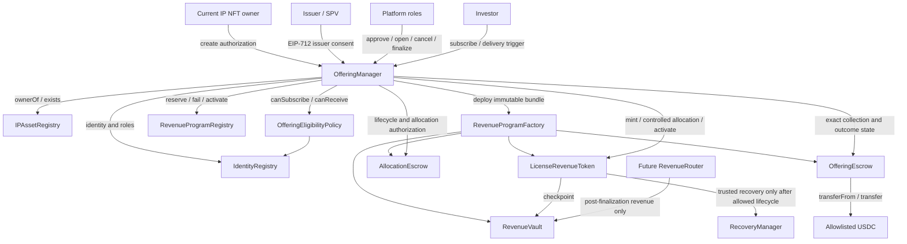

# Phase 3.2-1D OfferingManager Implementation Design Freeze

**Status:** Implementation design freeze  
**Date:** 2026-07-21  
**Scope:** Cross-contract OfferingManager orchestration from program creation through refund or activation  
**Implementation:** No Solidity changes in Phase 3.2-1D Design Freeze

## 1. Purpose and frozen baseline

This document converts the Phase 3.2-0, 1A, 1B, and 1C design freezes into one implementable contract interaction model.

The v1 baseline is:

- one offering for one IP asset revenue program;
- complete `LicenseRevenueToken.finalSupply` offered to investors;
- full eligible sell-out required for success;
- fixed-price, first-come-first-served allocation;
- exact six-decimal USDC settlement;
- Token pre-minted to AllocationEscrow before subscriptions;
- USDC held by OfferingEscrow until failure refund or successful finalization;
- post-close investor reconciliation before success;
- Token allocation completed before activation; and
- atomic Token, Registry, OfferingEscrow, and RevenueVault activation.

OfferingManager is the orchestration and state contract. It does not custody USDC or Revenue Tokens.

## 2. OfferingManager responsibilities

OfferingManager is responsible for:

- generating a unique `offeringId` and storing immutable program terms;
- validating current IP NFT ownership and asset-owner identity;
- validating issuer/SPV authorization and consent;
- coordinating platform approval;
- reserving one asset program in RevenueProgramRegistry;
- registering the exact Token, Vault, eligibility policy, RecoveryManager, AllocationEscrow, OfferingEscrow, and USDC bundle;
- opening an offering only after full Token custody is confirmed;
- calculating FCFS Token fill and exact USDC cost;
- maintaining canonical contribution, allocation, and reconciliation aggregates;
- coordinating atomic subscription calls to OfferingEscrow and AllocationEscrow;
- deriving success or failure after permissionless post-close reconciliation;
- permitting immutable Token allocation delivery only after success;
- atomically finalizing Token activation, Registry activation, proceeds classification, and Vault opening;
- tombstoning all failed program components; and
- exposing complete lifecycle and accounting data for audit and integration.

OfferingManager must not:

- hold offering USDC or Revenue Tokens;
- alter economic terms after opening;
- manually override equality-based success;
- release escrow assets through an admin shortcut;
- act as IdentityRegistry verifier;
- deposit offering principal into RevenueVault;
- execute Revenue Token wallet recovery; or
- create a second live program for the same asset.

## 3. Contract dependency graph



### 3.1 Immutable system dependencies

OfferingManager deployment fixes or governance-registers:

```text
IdentityRegistry
RevenueProgramRegistry
RevenueProgramFactory
supported IPAssetRegistry set
supported USDC set
approved eligibility-policy implementations
platform role administrator
```

Per-offering dependencies are frozen at opening and cannot be substituted.

### 3.2 Factory boundary

`RevenueProgramFactory` deploys or verifies a deterministic program bundle. OfferingManager remains the Token controller during primary issuance, while custody stays in the two Escrows.

Factory deployment does not reserve an asset or authorize an offering by itself. A bundle is usable only when RevenueProgramRegistry binds its addresses to the exact `offeringId` and asset key.

## 4. Core storage model

Conceptually:

```text
Offering {
    state
    creator
    assetRegistry
    assetId
    assetOwnerAtCreation
    issuer
    issuerTreasury
    eligibilityPolicy
    revenueToken
    revenueVault
    allocationEscrow
    offeringEscrow
    recoveryManager
    usdc
    finalSupply
    pricePerWholeTokenUSDC
    allocationLot
    targetUSDC
    opensAt
    closesAt
    settlementDeadline
    termsHash
    disclosureHash
    committedSupply
    committedUSDC
    soldSupply
    acceptedUSDC
    subscriptionCount
    reconciledCount
    allocatedSupply
}

Subscription {
    contributor
    investorCommitment
    destination
    requestedTokenAmount
    filledTokenAmount
    usdcAmount
    sequence
    paymentReferenceHash
    reconciliationStatus
    allocationDelivered
}
```

Offering states are exactly:

```text
Draft -> Open -> Successful -> Finalized
              \
               -> Failed
```

`Open` contains time-derived Funding and Reconciliation subphases. Subscription status is separate from offering state and includes at least `None`, `Committed`, `Included`, and `Excluded`.

## 5. `createOffering` flow

### 5.1 Caller and authorization

The caller is the current IP Asset NFT owner or presents a domain-separated authorization from that owner. At creation:

- `IPAssetRegistry.exists(assetId)` is true;
- `ownerOf(assetId)` matches the authorizer;
- authorizer identity is currently verified with `ROLE_ASSET_OWNER`;
- issuer/SPV passes a dedicated issuer-eligibility policy;
- issuer consent signs the exact asset, treasury, terms, Token economics, deadlines, chain, and Manager;
- terms and disclosure hashes are nonzero;
- USDC and policy implementations are allowlisted; and
- all addresses and numeric terms are valid.

Issuer eligibility must not overload `ROLE_INVESTOR`. Production implementation requires a dedicated `ROLE_ISSUER` or bound issuer-policy interface frozen before coding.

### 5.2 Identifier and asset reservation

Conceptually:

```text
assetKey = keccak256(chainId, assetRegistry, assetId)

offeringId = keccak256(
  chainId,
  OfferingManager,
  assetKey,
  issuer,
  creatorNonce,
  termsHash
)
```

OfferingManager first ensures the ID is unused, then reserves `assetKey` in RevenueProgramRegistry. Reservation rejects another live offering or an existing active program.

### 5.3 Bundle creation

The factory creates or registers:

- `LicenseRevenueToken` with immutable asset, supply, policy, and Manager controller;
- `RevenueVault` with immutable Token and USDC;
- `AllocationEscrow` with immutable Manager/offering/Token binding; and
- `OfferingEscrow` with immutable Manager/offering/USDC/beneficiary binding.

The Token binds the exact Vault and RecoveryManager while still `Created`. RevenueProgramRegistry records the complete bundle hash.

### 5.4 State commit

`createOffering` stores `Draft` only after reservation and bundle validation succeed. Any failure reverts the reservation, deployment transaction effects, nonce consumption, and Manager record.

No Token is minted and no USDC is accepted during `createOffering`.

### 5.5 Approval step

A separate platform approver reviews the Draft and records approval. The approver cannot be the creator or identity verifier under the production separation policy. Approval commits to the complete bundle and frozen terms; any Draft amendment invalidates prior approval.

## 6. `openOffering` flow

`openOffering(offeringId)` is called by `OFFERING_OPERATOR_ROLE` at or after `opensAt` and before `closesAt`.

### 6.1 Revalidation

Immediately before opening:

- state is `Draft` and platform approval is current;
- asset still exists and the authorizing owner still owns it;
- asset owner and issuer identities remain valid;
- issuer treasury and consent remain valid;
- RevenueProgramRegistry reservation and bundle hash match;
- Token, Vault, RecoveryManager, both Escrows, eligibility policy, and USDC bindings match;
- no legal hold or cancelled authorization is active;
- `finalSupply`, price, allocation lot, and target USDC are mathematically exact; and
- RevenueVault has no accounted deposit.

### 6.2 Atomic pre-mint custody

One transaction performs:

```text
1. Token.beginMinting()
2. grant/use narrowly scoped primary minter authority
3. Token.mint(AllocationEscrow, finalSupply)
4. AllocationEscrow.confirmTokenDeposit()
5. verify Token.totalSupply == finalSupply
6. verify AllocationEscrow balance == finalSupply
7. freeze all Offering terms
8. set Offering state Open
9. emit OfferingOpened
```

If any step fails, Token lifecycle, mint, Escrow confirmation, and Manager state all revert. Retrying remains possible while time and Draft authorization remain valid.

### 6.3 Post-open authority reduction

After opening:

- no additional Token mint is permitted;
- Draft configuration and approval cannot change;
- only subscription/reconciliation/failure paths are available;
- AllocationEscrow cannot release Token; and
- OfferingEscrow may collect only exact Manager-authorized subscriptions.

## 7. `subscribe` flow

Conceptual input:

```text
subscribe(
  offeringId,
  requestedTokenAmount,
  minFill,
  maxUSDC,
  destination,
  investorCommitment,
  paymentReferenceHash,
  destinationConsent
)
```

### 7.1 Checks and quote

OfferingManager verifies:

- offering state is `Open` and current time is in Funding `[opensAt, closesAt)`;
- contributor and destination are nonzero;
- contributor/destination identity and offering eligibility pass;
- destination consent is bound to this exact offering and request;
- requested amount and `minFill` are nonzero and allocation-lot aligned;
- `minFill <= requestedTokenAmount`;
- per-investor, jurisdiction, and concentration limits pass;
- payment reference and terms commitment are valid; and
- no legal hold or subscription pause blocks collection.

Manager computes:

```text
remaining = finalSupply - committedSupply
filled = min(requestedTokenAmount, remaining)
require filled >= minFill

usdcCost
  = filled * pricePerWholeTokenUSDC / 10^18

require usdcCost <= maxUSDC
```

Allocation-lot validation makes the price division exact.

### 7.2 Unique subscription

Manager derives a domain-separated `subscriptionId` from offering, contributor nonce, destination, filled amount, and terms. It increments the nonce only in the successful transaction and rejects reused payment references according to v1 policy.

### 7.3 Atomic custody and accounting

One non-reentrant transaction performs:

```text
1. OfferingEscrow.collectContribution(exact tuple and usdcCost)
2. store immutable Manager Subscription as Committed
3. committedSupply += filled
4. committedUSDC += usdcCost
5. subscriptionCount += 1
6. AllocationEscrow.registerAllocation(exact same tuple and sequence)
7. cross-check both Escrow totals against Manager totals
8. emit SubscriptionAccepted
```

OfferingEscrow pulls only `usdcCost`. No excess USDC enters custody. If either Escrow call or any aggregate check fails, USDC, Manager accounting, allocation record, sequence, and contributor nonce all revert.

### 7.4 Full commitment

When `committedSupply == finalSupply`, remaining capacity is zero and further subscriptions revert. The offering remains `Open` until `closesAt` so closing-time identity reconciliation is not bypassed.

## 8. Reconciliation flow

### 8.1 Start condition

At `block.timestamp >= closesAt`, subscriptions stop and the same stored `Open` state enters its derived Reconciliation subphase.

Anyone may call bounded reconciliation functions. No platform operator is required for liveness.

### 8.2 Per-subscription reconciliation

For each `Committed` subscription:

```text
reconcileSubscription(offeringId, subscriptionId)
```

Manager rechecks:

- contributor/investor identity continuity;
- destination identity, `ROLE_INVESTOR`, and offering eligibility;
- jurisdiction, sanctions/legal hold, accreditation, and concentration policy;
- destination consent and attestation validity;
- OfferingEscrow funded tuple;
- AllocationEscrow registered tuple; and
- no duplicate reconciliation.

If eligible:

```text
status = Included
soldSupply += filledTokenAmount
acceptedUSDC += usdcAmount
```

If ineligible:

```text
status = Excluded
```

In both cases `reconciledCount` increments once. Exclusion does not immediately move USDC or Token.

### 8.3 Outcome settlement

After `reconciledCount == subscriptionCount`, anyone calls `settleOffering`.

```text
if soldSupply == finalSupply
   and acceptedUSDC == targetUSDC:
       state = Successful
       emit OfferingSuccessful
else:
       execute atomic failure flow
```

Because v1 requires full eligible sell-out, one excluded or unfilled Token unit makes the entire offering fail and every contribution refundable.

### 8.4 Eligibility race and settlement validity

Reconciliation records the identity/policy version or attestation nonce used for each included destination. Allocation delivery rechecks current eligibility before moving Token.

If eligibility changes after `Successful` but before delivery, release fails closed. The offering cannot revert to `Failed` after any success allocation may have been delivered. A same-beneficial-owner replacement destination requires a separately authorized, consented remediation record that preserves amount, contributor, price, and subscription ID.

Until that remediation is implemented, production configuration must use settlement-validity horizons and an operational settlement deadline. Unresolved post-success eligibility is a legal-hold/liveness condition, never permission for an admin destination substitution.

## 9. Successful allocation delivery

While state is `Successful`, an investor or relayer may call OfferingManager to deliver an immutable included allocation.

Manager verifies:

- subscription status is `Included` and not delivered;
- OfferingEscrow contribution remains funded and not refunded;
- AllocationEscrow record matches;
- destination remains eligible; and
- Token is still in the pre-activation allocation lifecycle.

Manager calls AllocationEscrow, which invokes the Token's dedicated controlled pre-activation allocation path. On success:

```text
subscription.allocationDelivered = true
allocatedSupply += filledTokenAmount
```

The call and both records are atomic. Delivery can be permissionlessly triggered but no caller can change subscription parameters.

When `allocatedSupply == finalSupply`, finalization becomes eligible.

## 10. Finalize atomic transaction

`finalizeOffering(offeringId)` is callable by the offering operator and may also be permissionless once every precondition is objectively satisfied.

### 10.1 Preconditions

```text
Offering state == Successful
soldSupply == committedSupply == finalSupply
acceptedUSDC == committedUSDC == targetUSDC
reconciledCount == subscriptionCount
allocatedSupply == finalSupply
AllocationEscrow.totalReleased == finalSupply
AllocationEscrow Token balance == 0
Token.totalSupply == Token.finalSupply == finalSupply
Token lifecycle == Minting
RevenueVault.totalDeposited == 0
RevenueVault.totalClaimed == 0
OfferingEscrow.totalContributed == targetUSDC
OfferingEscrow is solvent
RevenueProgramRegistry status == Reserved
all registered bindings and terms hashes match
```

### 10.2 Atomic call order

Conceptually:

```text
1. enter OfferingManager nonReentrant finalization guard
2. set transient/finalizing effect or state according to CEI-safe implementation
3. LicenseRevenueToken.activate()
4. RevenueProgramRegistry.activateProgram(exact bundle)
5. OfferingEscrow.classifySuccessfulProceeds(target, fee formula)
6. RevenueVault.enableProgramDeposits(exact active program)
7. set Offering state Finalized
8. permanently revoke/disable primary mint and allocation authority
9. emit OfferingFinalized
10. exit guard
```

Exact code order may move local state before external calls for CEI, but every dependency must validate the same in-flight finalization tuple. A revert restores Token lifecycle, Registry status, Escrow liabilities, Vault gate, Manager state, and primary authorities.

### 10.3 No investor loop

Finalization never transfers investor Token or pushes USDC. All Token allocations are already delivered; issuer and fee beneficiaries pull USDC afterward.

## 11. Failure flow

### 11.1 Derived failure

After complete reconciliation, `settleOffering` derives failure when:

```text
soldSupply < finalSupply
or acceptedUSDC < targetUSDC
```

### 11.2 Authorized cancellation

During Funding, a narrow cancellation role may fail an offering only when:

- state is `Open` and not yet in Reconciliation;
- no Token allocation has been delivered;
- nonzero reason and evidence commitments are provided; and
- frozen offering/legal policy permits cancellation.

Issuer or default admin status alone does not authorize cancellation.

### 11.3 Atomic failure transaction

Failure performs:

```text
1. set/check in-flight failure guard
2. RevenueProgramRegistry.failOffering(offeringId, reason)
3. AllocationEscrow.tombstone(reason)
4. OfferingEscrow.verifyFailureLiability(totalContributed)
5. set Offering state Failed
6. disable all subscription, reconciliation, allocation, activation, and proceeds paths
7. emit OfferingFailed
```

OfferingEscrow refund entitlement is derived from canonical `Failed`; it does not require a loop or per-investor credit push during transition.

If Registry, either Escrow, or invariant validation fails, failure state and tombstone effects revert together.

### 11.4 Failed Token isolation

ProgramRegistry and LicenseRevenueToken must permanently reject:

- Token activation;
- AllocationEscrow release;
- ordinary transfer from the Escrow;
- RecoveryManager migration using AllocationEscrow as source; and
- RevenueVault deposits.

Failure preserves the pre-minted Token and allocation audit trail rather than burning or rescuing it.

## 12. Refund flow

OfferingManager does not transfer refunds. After Manager state is `Failed`, the original contributor calls OfferingEscrow directly:

```text
claimRefund(subscriptionId)
```

OfferingEscrow verifies canonical Manager state and immutable contribution, clears the credit through CEI, transfers exact USDC, and updates `totalRefunded`.

Manager exposes read-only correlation but does not mark the subscription refunded through a callback. OfferingEscrow is the canonical payment-status ledger.

Refund rules:

- every funded contribution is fully refundable in failed v1;
- refund goes only to original contributor;
- each subscription refunds at most once;
- failed USDC transfer preserves credit;
- no issuer or fee proceeds exist in `Failed`; and
- unclaimed refunds remain solvent liabilities without an investor loop.

## 13. Token activation flow

### 13.1 Controlled pre-activation allocation

LicenseRevenueToken needs one new primary-allocation movement distinct from ordinary transfer and recovery. It must:

- trust only the registered OfferingManager/AllocationEscrow tuple;
- require OfferingManager `Successful`;
- match an immutable included subscription;
- check destination eligibility;
- preserve `totalSupply`;
- pass through `_update()` and the Vault checkpoint;
- require zero accounted pre-activation revenue; and
- become permanently unavailable at `Finalized` or `Failed`.

### 13.2 Activation authority

Only OfferingManager's valid finalization path controls Token activation. Asset owner, issuer, minter, AllocationEscrow, RecoveryManager, and generic platform EOA have no parallel path.

### 13.3 Activation effects

Successful activation:

- freezes minting permanently;
- confirms `totalSupply == finalSupply`;
- enables compliance-restricted ordinary transfers only after Manager finalization completes;
- leaves all holder reward debt aligned at a zero pre-revenue accumulator; and
- does not itself create RevenueVault entitlement or deposit funds.

If Token activation succeeds locally but a later finalization dependency reverts, EVM atomicity restores the prior Token lifecycle.

## 14. RevenueProgramRegistry activation

RevenueProgramRegistry is the global source of program uniqueness and status.

Conceptual statuses:

```text
None -> Reserved -> Active
                \
                 -> Failed
```

### 14.1 Reservation

At `createOffering`, Registry reserves:

```text
assetKey
offeringId
issuer
Token
Vault
AllocationEscrow
OfferingEscrow
eligibilityPolicy
USDC
termsHash
bundleHash
```

One asset key has at most one live reservation and at most one active program.

### 14.2 Activation

Only the registered OfferingManager may activate, during its exact in-flight finalization. Registry rechecks:

- caller and offering ID;
- Reserved status;
- complete bundle and terms hash;
- Token active lifecycle and exact final supply;
- AllocationEscrow full release;
- OfferingEscrow exact target funding;
- Manager `Successful`/finalizing state; and
- no other active program for the asset.

Activation permanently consumes the asset's active-program slot.

### 14.3 Failure and tombstone

Failure records the attempt and bundle permanently, releases only the live-offering reservation, and permits a new attempt with a new offering ID and new program bundle. A failed bundle can never become active later.

## 15. Permissions

### 15.1 Operational roles

| Role or actor | OfferingManager action | Constraints |
|---|---|---|
| Current verified asset owner | Create Draft or authorize creation | Must own NFT and hold active `ROLE_ASSET_OWNER` |
| Verified issuer/SPV | Consent to exact terms and treasury | Dedicated issuer policy; no lifecycle override |
| `OFFERING_APPROVER_ROLE` | Approve exact Draft bundle/terms | Separate from creator and identity verifier |
| `OFFERING_OPERATOR_ROLE` | Open and finalize when objective checks pass | Cannot override totals or redirect custody |
| `OFFERING_CANCELLER_ROLE` | Cancel eligible Funding-state offering | Reason/evidence required; never after success |
| Eligible investor | Subscribe during Funding | Identity, policy, limits, exact USDC, consent |
| Investor or relayer | Trigger reconciliation and immutable allocation delivery | Cannot alter tuple or destination |
| Any account | Settle fully reconciled outcome; fail derived underfill; optionally finalize ready success | All conditions objective and rechecked |
| Identity verifier | Update IdentityRegistry/policy attestations | No offering lifecycle or custody power |
| Default admin | Administer operational roles | Does not bypass state, separation, or economic checks |

### 15.2 Cross-contract caller permissions

```text
OfferingManager only
  -> OfferingEscrow.collectContribution
  -> AllocationEscrow.confirm/register/release/tombstone
  -> Token primary mint/allocation/activation path
  -> ProgramRegistry reserve/activate/fail for its offering

Original contributor only
  -> OfferingEscrow.claimRefund

Issuer treasury only
  -> OfferingEscrow.claimIssuerProceeds

Fee recipient only
  -> OfferingEscrow.claimProtocolFee
```

No admin, issuer, or asset owner may call an Escrow economic action merely because it holds a role elsewhere.

### 15.3 Reentrancy and pause domains

Create, open, subscribe, settle, fail, deliver, and finalize entry points are non-reentrant where they mutate cross-contract state.

Independent pauses may stop new subscriptions or settlement actions, but they:

- cannot change outcomes or terms;
- cannot erase allocation, refund, or proceeds liabilities;
- cannot permit precondition bypass;
- must leave permissionless expiry/failure available where legally required; and
- require a frozen liveness policy for post-success allocation/finalization.

## 16. Events

### 16.1 Creation and approval

```text
OfferingCreated(
  offeringId,
  assetRegistry,
  assetId,
  creator,
  issuer,
  token,
  vault,
  allocationEscrow,
  offeringEscrow,
  programBundleHash
)

OfferingApproved(offeringId, approver, termsHash, approvalNonce)
```

### 16.2 Lifecycle

```text
OfferingOpened(
  offeringId,
  finalSupply,
  targetUSDC,
  opensAt,
  closesAt
)

OfferingSuccessful(
  offeringId,
  soldSupply,
  acceptedUSDC,
  reconciledCount,
  successfulAt
)

OfferingFailed(
  offeringId,
  committedSupply,
  committedUSDC,
  soldSupply,
  acceptedUSDC,
  reasonCode,
  evidenceHash,
  failedAt
)

OfferingFinalized(
  offeringId,
  token,
  vault,
  finalSupply,
  acceptedUSDC,
  finalizedAt
)
```

### 16.3 Subscription and reconciliation

```text
SubscriptionAccepted(
  offeringId,
  subscriptionId,
  sequence,
  contributor,
  investorCommitment,
  destination,
  requestedTokenAmount,
  filledTokenAmount,
  usdcAmount,
  paymentReferenceHash
)

SubscriptionReconciled(
  offeringId,
  subscriptionId,
  included,
  identityVersion,
  policyVersion
)

AllocationDeliveryConfirmed(
  offeringId,
  subscriptionId,
  destination,
  tokenAmount,
  allocatedSupply
)
```

Escrows emit their own custody and payment events using the same IDs. No event includes plaintext PII or document contents.

## 17. Invariants

### 17.1 Lifecycle

```text
Draft -> Open -> Successful -> Finalized
              \
               -> Failed

Failed and Finalized are terminal
Successful never becomes Failed
```

### 17.2 Program uniqueness and binding

```text
one assetKey -> at most one live offering
one assetKey -> at most one Active revenue program
one offeringId -> one immutable program bundle and terms hash
Failed bundle -> never Active
```

### 17.3 Subscription accounting

```text
sum(committed filled Token) == committedSupply
sum(committed USDC) == committedUSDC
sum(included Token) == soldSupply
sum(included USDC) == acceptedUSDC

0 <= soldSupply <= committedSupply <= finalSupply
0 <= acceptedUSDC <= committedUSDC <= targetUSDC
```

Manager, OfferingEscrow, and AllocationEscrow totals agree after every successful subscription.

### 17.4 Success and failure

```text
Successful or Finalized
  => reconciledCount == subscriptionCount
  => soldSupply == committedSupply == finalSupply
  => acceptedUSDC == committedUSDC == targetUSDC

Failed
  => no Token allocation delivered
  => every contribution refundable
  => no issuer proceeds or fee liability
```

No contribution receives both a successful Token allocation and failure refund.

### 17.5 Token allocation and supply

```text
AllocationEscrow Token balance + allocatedSupply == finalSupply
Token.totalSupply == finalSupply after opening

Finalized
  => allocatedSupply == finalSupply
  => AllocationEscrow balance == 0
  => Token.lifecycle == Activated
```

Primary allocation and recovery never change `totalSupply`.

### 17.6 USDC conservation and solvency

```text
OfferingEscrow.totalContributed
  == totalRefunded
   + totalIssuerWithdrawn
   + totalFeesWithdrawn
   + accountedEscrowBalance

actualUSDCBalance >= accountedEscrowBalance
```

Offering principal deposited into RevenueVault is always zero.

### 17.7 Activation

```text
RevenueProgramRegistry.Active
  <=> OfferingManager.Finalized
  <=> Token.Activated under this offering
  <=> RevenueVault deposit gate enabled
  <=> successful OfferingEscrow proceeds classified
```

These state changes succeed or revert as one finalization transaction.

### 17.8 Identity and authorization

- creation requires current owner plus active asset-owner identity;
- subscription and reconciliation both check identity and offering eligibility;
- allocation delivery rechecks destination eligibility;
- issuer consent and platform approval bind exact terms;
- executor roles cannot override equality-based outcomes;
- no plaintext PII is stored; and
- post-success invalid destination cannot be substituted without same-beneficial-owner remediation.

### 17.9 Replay and atomicity

- offering, subscription, payment reference, allocation, refund, and activation identifiers are single-use in their domains;
- failed external call changes no Manager or dependency state;
- each subscription's USDC collection, Manager record, and allocation registration are atomic;
- each allocation status and Token delivery are atomic;
- failure, Registry tombstone, and refund-enablement state are atomic;
- finalization dependencies are atomic; and
- reentrancy cannot consume capacity, payment, allocation, refund, or lifecycle transition twice.

## 18. Required implementation sequence and tests

Implementation should proceed in dependency order:

1. RevenueProgramRegistry and read-only policy interfaces;
2. OfferingManager Draft/Open state and bundle registration;
3. AllocationEscrow plus controlled pre-activation Token allocation;
4. OfferingEscrow plus exact USDC contribution/refund/proceeds accounting;
5. reconciliation and permissionless outcome settlement;
6. allocation delivery;
7. atomic finalization and RevenueVault deposit gate; and
8. handler-based stateful invariants across the full system.

Tests must include successful and failing calls at every cross-contract boundary, identity changes between subscription/reconciliation/delivery, FCFS partial fill, reconciliation exclusion, failed refund, successful proceeds claims, tombstone recovery bypass, bundle substitution, replay, reentrancy, and random conservation sequences.

## 19. Non-goals

This freeze does not add:

- soft-cap or partial-success offerings;
- issuer-retained active supply;
- auctions or pro-rata oversubscription;
- secondary-market liquidity;
- redemption or buyback;
- multiple settlement assets;
- fiat rails or swaps;
- cross-chain issuance;
- upgrade-time custody migration; or
- Solidity implementation.

Any such feature requires a new economic and security design version.
