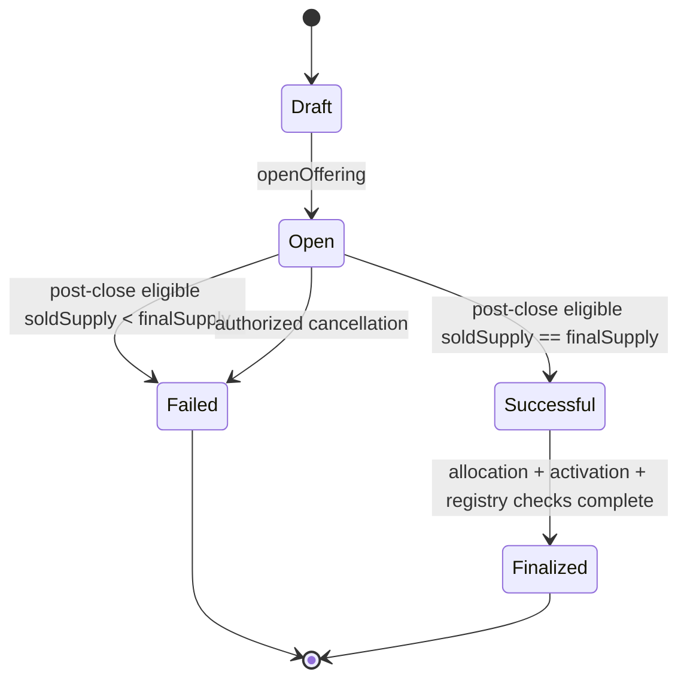

# Phase 3.2-1A OfferingManager State Machine Design Freeze

**Status:** Design freeze  
**Date:** 2026-07-21  
**Scope:** Offering lifecycle, authority, deterministic outcome, and future escrow integration boundaries  
**Implementation:** No Solidity changes in Phase 3.2-1A Design Freeze

## 1. Purpose and implementation boundary

`OfferingManager` is the canonical state machine for a primary Revenue Token offering. It determines when frozen terms become live, when an offering has sold out, when it has failed, and when a successful offering may activate its Token program.

Phase 3.2-1A implements only lifecycle and authorization in the next implementation step. It does not yet:

- transfer or custody USDC;
- release Revenue Tokens;
- activate `LicenseRevenueToken`;
- open RevenueVault deposits;
- calculate live subscriptions; or
- deploy AllocationEscrow or OfferingEscrow.

The state machine nevertheless freezes the interfaces and preconditions those modules must later satisfy. This prevents custody code from defining business outcomes implicitly.

## 2. Decisions at a glance

| Topic | Frozen v1 decision |
|---|---|
| States | `Draft`, `Open`, `Successful`, `Failed`, `Finalized` |
| Mint model | Complete `finalSupply` is pre-minted to AllocationEscrow before opening |
| Sale model | v1 offers the complete `finalSupply`; there is no issuer-retained or unsold active allocation |
| Allocation order | First confirmed transaction, first served; no pro-rata oversubscription |
| Oversubscription | Fill at most the remaining supply; transfer only accepted USDC; reject orders below caller `minFill` |
| Success | After closing-time reconciliation, eligible `soldSupply == finalSupply` and corresponding USDC liability is fully funded |
| Failure | Reconciled eligible supply is below `finalSupply`, or authorized cancellation occurs during funding |
| Finalization | All successful allocations delivered, Token activated, program registered active, and success proceeds enabled |
| Allocation release | Only OfferingManager may instruct AllocationEscrow, and only in `Successful` |
| USDC custody | OfferingEscrow accepts funds only in `Open`, refunds only in `Failed`, and releases proceeds only in `Finalized` |
| Revenue start | RevenueVault remains closed until `Finalized` |

This v1 specialization intentionally narrows the broader Phase 3.2-0 architecture. Future partial-sale or issuer-retained models require a new design version; they cannot be enabled by changing one cap.

## 3. Offering lifecycle states



### 3.1 `Draft`

`Draft` is the configuration and verification state. No subscriptions or investor funds are accepted.

Before leaving `Draft`, the Manager records and validates:

- `IPAssetRegistry` and `assetId`;
- current IP NFT owner authorization;
- issuer/SPV identity and treasury;
- RevenueProgramRegistry reservation;
- `LicenseRevenueToken`, `RevenueVault`, AllocationEscrow, and future OfferingEscrow addresses;
- exact allowlisted USDC address;
- `finalSupply`, fixed Token price, minimum lot, minimum subscription, opening time, and deadline;
- offering eligibility policy;
- immutable terms and disclosure hashes; and
- platform approval.

Draft configuration may be amended only before opening and only through explicit events. Once `Open`, every economic and identity-policy address is frozen.

### 3.2 `Open`

`Open` contains two time-derived subphases and is the only stored state used before outcome determination:

```text
Funding        = [opensAt, closesAt)
Reconciliation = at or after closesAt, until every commitment is revalidated
```

Properties:

- new subscriptions are accepted only during `Funding`;
- the complete `finalSupply` is already held by AllocationEscrow;
- `committedSupply` and committed USDC increase only through validated subscriptions;
- subscriptions use first-confirmed-transaction ordering;
- Token allocation cannot yet be released;
- issuer proceeds cannot be withdrawn;
- Revenue Token remains non-transferable to ordinary holders under its primary-allocation policy; and
- RevenueVault deposits remain disabled.

Reaching full commitment stops further subscriptions but does not bypass closing-time identity revalidation. During `Reconciliation`, commitments are processed in bounded calls: currently eligible commitments contribute to `soldSupply`, while invalid commitments become refundable. After every commitment is reconciled, the equality-based outcome is permissionlessly derivable.

### 3.3 `Successful`

`Successful` means the economic success criterion is permanently satisfied and the failure/refund outcome is no longer available for included subscriptions.

It is a settlement state, not the live revenue-program state. During `Successful`:

- AllocationEscrow may deliver only recorded successful allocations;
- USDC remains in OfferingEscrow;
- ordinary secondary Token transfers remain disabled;
- RevenueVault deposits remain disabled;
- allocation delivery may proceed in bounded batches or permissionless per-investor calls; and
- temporary technical failures are retryable and do not change the outcome to `Failed`.

There is no `Successful -> Failed` transition. This boundary is necessary because Token delivery must not be followed by a refund path that leaves an investor with both Token and USDC.

### 3.4 `Failed`

`Failed` is the terminal unsuccessful state. It may be entered only from `Open` when:

- post-close reconciliation completed with eligible `soldSupply < finalSupply`; or
- a narrowly authorized cancellation is valid before sell-out.

Effects expected from later integrations:

- OfferingEscrow exposes pull refunds for all committed subscriptions;
- issuer and platform proceeds remain inaccessible;
- AllocationEscrow releases no Token;
- the pre-minted Token/Vault program is tombstoned and can never activate;
- RevenueVault remains closed; and
- RevenueProgramRegistry may release the live-offering slot while preserving the failed attempt's audit record.

Unclaimed refunds remain liabilities after the state becomes `Failed`; no global investor loop is required before recording failure.

### 3.5 `Finalized`

`Finalized` is the terminal successful state. It means:

- every sold Token unit has been delivered to its recorded eligible destination;
- AllocationEscrow has no unresolved allocation;
- delivered supply equals `finalSupply`;
- `LicenseRevenueToken` is activated;
- RevenueProgramRegistry records the program as active;
- OfferingEscrow's success proceeds are withdrawable by fixed beneficiaries; and
- RevenueVault's active-program deposit gate may open.

The offering can never reopen and OfferingManager loses primary allocation and mint authority after finalization.

## 4. State transition rules

| From | To | Trigger | Required caller | Mandatory checks |
|---|---|---|---|---|
| `Draft` | `Open` | `openOffering` | Platform offering operator | Terms frozen; asset/issuer valid; registry slot reserved; full supply escrowed; current time valid |
| `Open` | `Successful` | `settleOffering` | Permissionless | Deadline elapsed; every commitment reconciled; eligible `soldSupply == finalSupply`; funded accepted USDC equals target |
| `Open` | `Failed` | `settleOffering` | Permissionless | Deadline elapsed; every commitment reconciled; eligible `soldSupply < finalSupply` |
| `Open` | `Failed` | `cancelOpenOffering` | Platform cancellation authority | Funding subphase; no allocation released; legal reason hash; cancellation policy permits it |
| `Successful` | `Finalized` | `finalizeOffering` | Platform offering operator or permissionless finalizer | Allocations reconciled; Token activation succeeds; registry and escrow bindings exact |

All other transitions revert.

### 4.1 Monotonicity

```text
Draft -> Open -> Successful -> Finalized
              \
               -> Failed
```

State never moves backward. `Failed` and `Finalized` are terminal. A role grant, admin call, paused dependency, or asset-NFT transfer cannot rewrite history.

### 4.2 Time rules

- `openOffering` cannot execute before `opensAt` or after `closesAt`.
- Subscriptions require `block.timestamp >= opensAt` and `block.timestamp < closesAt`.
- Full commitment before the deadline closes remaining capacity but remains `Open` until post-close reconciliation.
- At or after `closesAt`, no new subscription is accepted.
- Anyone may process reconciliation and settle the derived success/failure result; operator inactivity cannot lock the outcome or refunds.

The exact equality boundary uses one convention across the system: funding is open on `[opensAt, closesAt)`.

### 4.3 Configuration freeze

After `Draft -> Open`, the following never change:

```text
asset registry + assetId
issuer/SPV + treasury
RevenueProgramRegistry reservation
Token + Vault + escrow addresses
eligibility policy
USDC address and decimals
finalSupply
price and allocation lot size
opening and closing times
termsHash and disclosureHash
```

Changing any item requires cancelling before opening or creating a new tombstoned offering attempt with a new `offeringId`.

## 5. Roles and authority

### 5.1 Issuer/SPV

The issuer/SPV is the legal offering and future revenue-remittance obligor. It:

- consents to immutable offering terms and its treasury address in `Draft`;
- receives successful proceeds only after `Finalized`; and
- cannot declare success, release AllocationEscrow, activate the Token, or redirect refunds.

The issuer is data and legal authority, not an unrestricted on-chain administrator.

### 5.2 Platform

Platform powers are separated:

| Platform permission | Permitted action | Forbidden action |
|---|---|---|
| Offering configurator | Configure Draft terms and dependencies | Change terms after opening |
| Offering approver | Approve verified Draft configuration | Subscribe, verify identity, or withdraw funds by virtue of approval |
| Offering operator | Open and finalize when deterministic conditions pass | Override reconciled sold supply, skip identity/allocation reconciliation, or redirect custody |
| Cancellation authority | Cancel an eligible Open offering with reason commitment | Cancel after success or seize escrowed assets |
| Default admin | Grant and revoke operational roles | Bypass state or economic checks solely because it is admin |

Production governance should use separate multisig or timelocked authorities. One EOA should not simultaneously act as issuer, verifier, approver, operator, and custody beneficiary.

### 5.3 Investor

An investor may eventually:

- subscribe while `Open` after identity and eligibility checks;
- specify desired Token units, maximum USDC, minimum acceptable fill, and destination;
- receive only its recorded allocation after `Successful`;
- claim a refund after `Failed`; and
- use ordinary Token transfers and RevenueVault claims only after `Finalized`.

An investor cannot force success before sell-out, select another investor's allocation, claim both refund and successful allocation, or call escrow administration functions.

### 5.4 Verifier

The verifier maintains identity truth in IdentityRegistry or a bound verification adapter. OfferingManager consumes verification outcomes but does not grant identity roles.

The verifier:

- verifies issuer, asset owner, and investor identity according to policy;
- may update suspension, expiry, or revocation through the identity system; and
- cannot open, cancel, declare success, finalize, release funds, or release Token solely because it is a verifier.

### 5.5 Permission matrix

| Action | Issuer | Platform | Investor | Verifier | Permissionless |
|---|---:|---:|---:|---:|---:|
| Consent to issuer terms | Yes | No | No | No | No |
| Configure Draft | No | Authorized role | No | No | No |
| Verify identity | No | No | No | Authorized verifier | No |
| Open offering | No | Authorized operator | No | No | No |
| Subscribe | No | No | Eligible investor | No | No |
| Settle post-close outcome | No manual override | May trigger | May trigger | May trigger | Derived permissionlessly after reconciliation |
| Cancel Open offering | No | Cancellation role | No | No | No |
| Release Token allocation | No | Manager-mediated only | Claim own allocation | No | Deliver recorded allocation only |
| Finalize successful offering | No | Authorized operator | No | No | Optional liveness path when all checks pass |
| Withdraw issuer proceeds | Fixed treasury only | No | No | No | No |
| Claim refund | No | No | Own failed subscription | No | No |

## 6. Success criteria

### 6.1 Frozen v1 rule

The first version succeeds only when post-close identity reconciliation confirms a complete eligible sell-out:

```text
offeredSupply == finalSupply
soldSupply == finalSupply
acceptedUSDC == targetUSDC
```

During funding, `committedSupply` may reach `finalSupply`. At reconciliation, each commitment is rechecked against IdentityRegistry and offering eligibility. Only eligible commitments move into `soldSupply` and `acceptedUSDC`; excluded commitments become refundable. If any exclusion reduces eligible sold supply below `finalSupply`, the v1 offering fails rather than assigning the gap administratively.

There is no soft-cap success, pro-rata allocation, issuer-retained active supply, or discretionary unsold allocation in v1.

For fixed price `pricePerWholeTokenUSDC`:

```text
targetUSDC
  = finalSupply * pricePerWholeTokenUSDC / 10^tokenDecimals
```

The configuration must make this division exact. `targetUSDC` is computed by the protocol and cannot be independently configured to a conflicting value.

### 6.2 Why full sell-out is required

- every activated Token unit has a known investor owner;
- the economic denominator exactly matches paid primary allocations;
- no administrator decides who receives unsold future revenue rights;
- allocation reconciliation is binary and auditable;
- failure preserves all pre-minted supply inside tombstoned escrow; and
- RevenueVault never opens against ambiguous beneficial ownership.

### 6.3 No subjective override

Neither issuer nor platform may mark an offering `Successful` when the equality checks fail. Conversely, once all commitments are reconciled and the equality checks pass, an operator cannot choose to classify the offering as failed.

## 7. Oversubscription and price precision

### 7.1 First-come, first-served

Version 1 uses on-chain transaction ordering:

```text
remaining = finalSupply - committedSupply
filled = min(requestedTokenUnits, remaining)
```

- only `filled` units are recorded;
- only the exact USDC cost of `filled` units is transferred into OfferingEscrow;
- if `filled < investorMinFill`, the transaction reverts;
- after `remaining == 0`, later subscriptions revert as sold out; and
- no pro-rata recalculation occurs after acceptance.

An implementation should take desired Token units rather than first pulling an arbitrary USDC amount. This avoids accepting excess funds that then require a second refund transfer. The investor supplies `maxUSDC` as slippage/configuration protection.

FCFS exposes normal public-chain ordering and MEV considerations. A future auction or allowlisted batch requires a separate design; it must not reuse v1 semantics silently.

### 7.2 Decimal convention

The baseline requires:

```text
Token decimals = 18
USDC decimals  = 6
```

`pricePerWholeTokenUSDC` is denominated in USDC base units per one whole Revenue Token (`10^18` Token base units).

Example:

```text
1 Revenue Token = 2.50 USDC
pricePerWholeTokenUSDC = 2_500_000
```

For Token-base-unit allocation `q`:

```text
usdcCost = q * pricePerWholeTokenUSDC / 10^18
```

The v1 allocation lot enforces exact division:

```text
allocationLot
  = 10^18 / gcd(pricePerWholeTokenUSDC, 10^18)

q % allocationLot == 0
```

This avoids hidden floor/ceiling value transfer. Multiplication uses full-precision `mulDiv` logic, and deployment validates the exact allowlisted USDC contract reports six decimals. Symbols such as `USDC` are not identity.

### 7.3 Accounting equalities

After every accepted subscription during Funding:

```text
committedSupplyAfter
  = committedSupplyBefore + filled

committedUSDCAfter
  = committedUSDCBefore + usdcCost(filled)

committedSupply <= finalSupply
committedUSDC <= targetUSDC
```

After reconciliation:

```text
soldSupply <= committedSupply
acceptedUSDC <= committedUSDC
excludedUSDC = committedUSDC - acceptedUSDC
```

Success requires the eligible `soldSupply` and `acceptedUSDC` upper bounds to become exact equalities.

## 8. Failure handling

### 8.1 Deadline failure

At `block.timestamp >= closesAt`, every commitment is revalidated. Once reconciliation completes, an `Open` offering with eligible `soldSupply < finalSupply` is permissionlessly settled as failed. The transition records a reason code equivalent to `NOT_FULLY_ELIGIBLE_AND_SOLD`.

Later OfferingEscrow integration must atomically enable:

```text
refundable[investor] = committedUSDC[investor] - alreadyRefunded[investor]
```

No issuer proceeds or protocol fee become withdrawable.

### 8.2 Authorized cancellation

Cancellation after opening requires:

- offering is still `Open`;
- it is still in the Funding subphase and success has not been reconciled;
- caller holds the narrow cancellation role;
- a nonzero reason/evidence commitment is emitted; and
- no Token allocation has been released.

Cancellation becomes `Failed` and uses the same refund guarantees as deadline failure. Draft withdrawal may simply abandon the un-opened attempt, but its registry reservation and audit record must be released or tombstoned explicitly.

### 8.3 Dependency failure

A temporary revert from IdentityRegistry, eligibility policy, AllocationEscrow, OfferingEscrow, Token, Vault, or ProgramRegistry does not by itself change the offering outcome. The attempted action reverts and remains retryable in the same state.

### 8.4 Failed-program tombstone

Failure permanently binds the failed status to its `offeringId`, Token, Vault, and escrow addresses. They cannot be recycled into a later offering or activated through OfferingManager. RevenueProgramRegistry may permit a new attempt for the asset only with a new ID and newly registered program contracts.

## 9. Token activation trigger

`finalizeOffering` is the only OfferingManager path that may trigger Token activation. It requires `Successful` and verifies:

```text
soldSupply == finalSupply
acceptedUSDC == targetUSDC
allocatedSupply == finalSupply
unresolvedAllocation == 0
Token.totalSupply == Token.finalSupply == finalSupply
Token.lifecycle == Minting
Token/Vault/Manager/Registry bindings match the offering
ProgramRegistry status permits activation
OfferingEscrow covers all successful proceeds and fees
```

Atomic finalization order:

```text
1. recheck immutable dependency bindings and reconciliation totals
2. call LicenseRevenueToken.activate()
3. mark RevenueProgramRegistry program Active
4. mark OfferingManager state Finalized
5. enable fixed success withdrawals in OfferingEscrow
6. enable the RevenueVault active-program deposit gate
7. emit OfferingFinalized
```

If any step fails, Token activation, registry status, offering state, and escrow permissions all revert. The implementation may adjust call order for CEI and reentrancy safety, but it must preserve all-or-nothing semantics.

OfferingManager must be the Token controller for primary issuance, or the Token must trust a dedicated activation controller that recognizes only the registered Manager and offering. An asset-owner or platform EOA must not retain a parallel activation path.

## 10. AllocationEscrow interaction boundary

AllocationEscrow holds the complete pre-minted `finalSupply` without beneficial ownership.

### 10.1 Authority

Only the registered OfferingManager may authorize allocation release. There is no `onlyOwner` generic release, rescue, or arbitrary destination function.

An investor or permissionless relayer may trigger delivery only for an immutable Manager-recorded allocation. The Escrow revalidates the Manager, offering ID, state, Token, destination, and amount.

### 10.2 State boundary

| Offering state | AllocationEscrow behavior |
|---|---|
| `Draft` | May receive the one-time pre-mint during opening preparation; no release |
| `Open` | Holds full supply; no release |
| `Successful` | Releases exact recorded allocations only |
| `Failed` | Permanently locks tombstoned supply; no release or activation |
| `Finalized` | No unresolved allocation; primary release authority disabled |

### 10.3 Required handshake

Future release is semantically equivalent to:

```text
deliverAllocation(offeringId, subscriptionId, investor, destination, amount)
```

It must prove:

- subscription is included in the successful sold-out set;
- amount and destination exactly match the immutable record;
- destination passes execution-time eligibility;
- subscription allocation has not already been delivered; and
- cumulative delivered supply remains at or below `finalSupply`.

The current Revenue Token forbids ordinary transfers before activation. Phase 3.2-1B must therefore design a narrow pre-activation allocation movement that cannot be used for secondary transfers and is permanently disabled at activation.

## 11. OfferingEscrow interaction boundary

OfferingEscrow is the sole custodian of primary-sale USDC. OfferingManager stores lifecycle and validated subscription accounting; it does not hold USDC.

| Offering state | OfferingEscrow behavior |
|---|---|
| `Draft` | No deposits, refunds, or proceeds withdrawals |
| `Open` | Accepts exact Manager-authorized USDC subscription amounts |
| `Successful` | Holds all funds; no ordinary refund or issuer withdrawal |
| `Failed` | Enables pull refunds; disables issuer/fee withdrawal |
| `Finalized` | Enables fixed issuer/fee pull withdrawals; no v1 failure-refund liability exists |

Required boundary rules:

- only exact allowlisted USDC is accepted;
- actual balance increase must equal the recorded amount;
- each `subscriptionId` funds at most once;
- every accepted USDC unit remains classified as refund, proceeds, fee, or current escrow balance;
- Manager state transitions cannot withdraw funds directly;
- failed USDC transfers revert accounting; and
- OfferingEscrow never calls RevenueVault or classifies offering principal as revenue.

Phase 3.2-1A may define an interface placeholder but must not implement USDC receipt or payment logic.

## 12. Events

Events must permit reconstruction of state, authority, and immutable terms without plaintext PII.

### 12.1 Configuration events

```text
OfferingCreated(
  offeringId,
  assetRegistry,
  assetId,
  issuer,
  token,
  vault,
  allocationEscrow,
  offeringEscrow
)

OfferingTermsConfigured(
  offeringId,
  usdc,
  finalSupply,
  pricePerWholeTokenUSDC,
  targetUSDC,
  opensAt,
  closesAt,
  termsHash,
  disclosureHash
)
```

Draft amendments emit their own old/new-value events. A single opaque update event is insufficient for audit reconstruction.

### 12.2 Lifecycle events

```text
OfferingOpened(offeringId, openedAt, finalSupply, targetUSDC)

OfferingSuccessful(
  offeringId,
  soldSupply,
  acceptedUSDC,
  successfulAt
)

OfferingFailed(
  offeringId,
  committedSupply,
  committedUSDC,
  soldSupply,
  acceptedUSDC,
  reasonCode,
  evidenceHash,
  failedAt
)

OfferingFinalized(
  offeringId,
  token,
  vault,
  finalSupply,
  acceptedUSDC,
  finalizedAt
)
```

### 12.3 Future integration events

```text
SubscriptionAccepted(
  offeringId,
  subscriptionId,
  investorCommitment,
  destination,
  requestedUnits,
  filledUnits,
  committedUSDC
)

AllocationDelivered(
  offeringId,
  subscriptionId,
  destination,
  tokenAmount
)

RefundClaimed(offeringId, subscriptionId, investor, usdcAmount)
OfferingProceedsClaimed(offeringId, beneficiary, usdcAmount)
```

The v1 1A implementation emits configuration and lifecycle events only. Later phases add custody events without changing lifecycle meanings.

## 13. Invariants

### 13.1 State invariants

```text
state transitions are monotonic
Failed and Finalized are terminal
Successful can only follow complete post-close reconciliation and exact eligible sell-out
Finalized can only follow Successful
Failed can never become Successful or Finalized
```

### 13.2 Configuration invariants

- immutable offering fields cannot change after opening;
- one `offeringId` identifies one asset, issuer, Token/Vault pair, USDC, price, and time window;
- RevenueProgramRegistry permits at most one live offering per asset;
- a failed program pair can never be reused or activated; and
- configured target USDC equals the exact price-derived value for `finalSupply`.

### 13.3 Supply and subscription invariants

```text
0 <= soldSupply <= committedSupply <= finalSupply
0 <= acceptedUSDC <= committedUSDC <= targetUSDC

Successful or Finalized
  => soldSupply == finalSupply
  => acceptedUSDC == targetUSDC

sum(recorded filled Token units) == committedSupply
sum(reconciled eligible Token units) == soldSupply
sum(recorded committed USDC) == committedUSDC
sum(reconciled accepted USDC) == acceptedUSDC
```

### 13.4 Custody invariants for future integrations

```text
AllocationEscrow balance + delivered Token == finalSupply

OfferingEscrow USDC
  >= outstanding refunds
   + unreleased proceeds
   + unreleased fees

USDC received
  == refunded + released + current escrow balance
```

Offering principal deposited into RevenueVault is always zero.

### 13.5 Outcome exclusivity

```text
Failed
  => refund path enabled
  => allocation, activation, and issuer proceeds paths disabled

Finalized
  => successful allocation and proceeds paths enabled
  => ordinary failure refund path disabled
```

No subscription may yield both a successful Token allocation and a failure refund.

### 13.6 Authority invariants

- issuer cannot self-declare success or withdraw before finalization;
- platform cannot override equality-based success;
- verifier cannot operate the offering by virtue of identity authority;
- investor can affect only its own subscription, allocation, and refund;
- AllocationEscrow accepts no arbitrary release authority;
- OfferingEscrow accepts no arbitrary withdrawal authority; and
- default admin cannot bypass lifecycle checks.

### 13.7 Atomicity and reentrancy invariants

- each subscription accounting update and each reconciliation update succeeds or reverts atomically;
- the final reconciliation and derived `Open -> Successful/Failed` transition succeed or revert together;
- failure transition and refund enablement succeed or revert together once OfferingEscrow is integrated;
- finalization, Token activation, registry activation, and success-withdrawal enablement succeed or revert together;
- external callback failure leaves state and aggregate totals unchanged; and
- reentrancy cannot record the same subscription, allocation, refund, or transition twice.

## 14. Required Phase 3.2-1A implementation tests

The state-machine-only implementation must cover:

- only authorized platform role can create/configure/open;
- cannot open before `opensAt` or after `closesAt`;
- cannot open without frozen dependencies and registry reservation;
- configuration is immutable after opening;
- invalid transitions revert from every state;
- success cannot be set manually below eligible `finalSupply`;
- full commitment does not bypass closing-time identity reconciliation;
- exact eligible sell-out derives `Successful` once after reconciliation;
- investor invalidation creates excluded/refundable commitment and may derive `Failed`;
- oversell cannot make `committedSupply > finalSupply`;
- reconciled expired underfill can be failed permissionlessly;
- failed and finalized states are terminal;
- cancellation requires its narrow role and reason commitment;
- `Successful` cannot become `Failed`;
- finalization requires every future integration precondition, represented by mocks in 1A;
- dependency failure rolls back the transition; and
- role overlap does not bypass state or equality checks.

No 1A test should transfer real USDC or Revenue Tokens. Custody behavior belongs to 1B and 1C.

## 15. Deferred work

Phase 3.2-1B freezes and implements AllocationEscrow plus the Token's controlled pre-activation delivery path.

Phase 3.2-1C freezes and implements OfferingEscrow, exact USDC subscription accounting, FCFS partial fill, and refunds.

Phase 3.2-1D integrates finalization with Token activation, RevenueProgramRegistry activation, proceeds release, and RevenueVault's active-program deposit gate.

OfferingManager state meanings frozen here must remain unchanged across those integrations.
